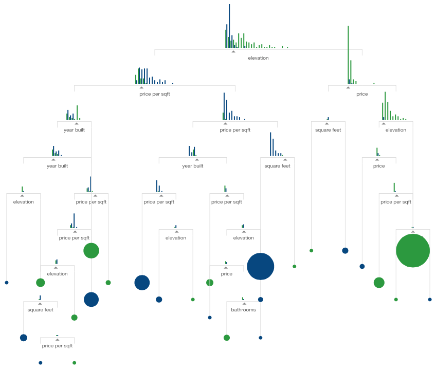

**Numeerisen** tiedon visualisointi sai alkunsa ranskalaisen filosofin ja matemaatikon Rene Descartesin kehittämän koordinaatiston myötä. Koordinaatiston perusteella skottilainen William Playfair kehitti tekniikoita taloudellisten numeroaineistojen visualisointiin.

_Playfair 1786_

Playfairin visualisaatiot näyttävät edelleen hyvältä ja samanlaisia kuvia piirretään nykyäänkin.

Hyvin tehty visualisaatio voi sisältää enemmänkin informaatiota ja on parhaimmillaan hämmästyttävän informatiivinen ja vaikuttava. Kuuluisa esimerkki tästä on Charlees Joseph Minardin visualisaatio Napoleonin armeijan epäonnistuneesta sotaretkestä Venäjälle 1812-1813.

_Minard 1869_

Uutta visualisoinnissa nykyään on se, että verkkosivut mahdollistavat interaktiiviset visualisaatiot. Googlella on esimerkiksi [musiikkigenrejen historiallista suosiota kuvaava visualisaatio](http://research.google.com/bigpicture/music/#), joka perustuu Google Play käyttäjien musiikkikirjastoihin.

Myös artikkeleihin voi liittää interaktiivisia visualisaatioita. Flowingdata.com on visualisointiin keskittynyt verkkosivu, joka on listannut vuoden 2015 top10 visualisoinnit. Yksi näistä visualisoinneista on r2d3 projektin [Machine Learningia selittävä artikkeli](http://www.r2d3.us/visual-intro-to-machine-learning-part-1/), jossa jokaisen kappaleen käsitteitä havainnollistetaan interaktiivisela visualisaatiolla.
