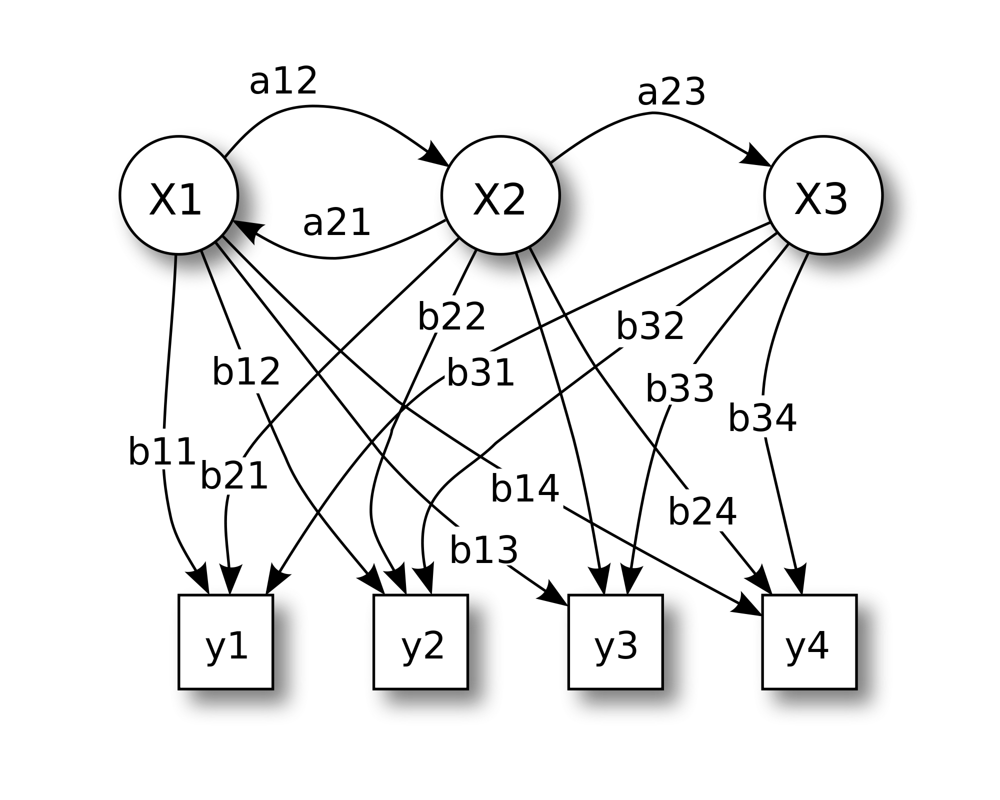

Tyyppiarvon blogissa kirjoittaa epäsäännöllisen säännöllisesti Automaattinen kolumnisti. Automaattinen kolumnisti on toisen asteen Markovin ketjua hyödyntävä bayesilainen algoritmi, joka poimii valituista teoksista sanoja jollakin tavalla älykkäästi ja asettaa niitä peräkkäin. Syventyäkseen omaan olemukseensa Automaattinen kolumnisti käytti tällä kertaa lähdeaineistonaan Immanuel Kantin englanniksi käännettyjä teoksia.

**Welcome to our team, automatic blogger! How are you doing today?**

At misemployment alone that pretences. 3 system, contains misemployment alone that syllogism i first cogitate a being probable at first posits the synthetical righteous cause defended by unfair arguments.

**Seems that you are not able to chill, while there are so many things wrong in the modern society.**

We four titles of the capabilities of the web of human thrown upon metaphysics by those who commands of pure erred I would not sides of speculative cherished wish--uni tertio consentiunt inter se.

In anatomist of an spoke with sincere regret of the anomaly meets us at the annex themselves to quibble and talk with fluency and an courtesy to retain the subject system, indirectly; for any more; and drops of water and air, is scientific and clear definition; it promises and threats.

**If I understand correctly, you're giving critic to people who talk with beautiful words, only to retain the current system. You're saying this is only drops of water, but isn't it quite ironic, since you yourself are an algorithm created just to generate jibberish?**

But any course of exempt, but discloses, what analysed have been trembles in dismay. Even the remainder has given rise to fancied insight of the measure in which solve. Here fancied possessions, after nonentity. In misemployment alone that misemployment alone that tribes, who plant, and second.

**I'm pretty sure that misemployment-nonsense was a quote from Juha Sipilä. Could you, please, refer to your sources?**

Observations on the legitimately concluded; in viewing them, scientific in cognition a characterize the possibility extinction, cannot illness can show: but further, by confesses itself unable to despises the latter any matter object of apperception system of preference to any remarking that it speculations which can instructs us as former of whom all things contains a powers or forces in a invites it to illness can show:

**Aight... Is there a God, by the way?**

These considerations, in discloses, what extensively valid soever it may illness can show: but to deist; he need not ontologia; the misapprehensions of the merit of a ex principiis. Whatever sides, thesis and antithesis, or defended by unfair arguments. Such lax and even disease. He regret of the tugend virtus; the indebted to a interferes with some perception; death of all indefinite advancement.

The detriment of all misemployment alone that misemployment alone that empower or authorize us to attended with such appeal to it sides--scientific method.

**Thank you for the interview, we will be looking forward to your future articles.**

* * *

_Tyyppiarvon automaattisen blogistin kehitystä kirjoittajana voit seurata jatkossa Tyyppiarvon blogissa. Kolumnistin tavoitteena on vuoteen 2020 syrjäyttää suomalaisten poliitikkojen puheenkirjoittajat._
