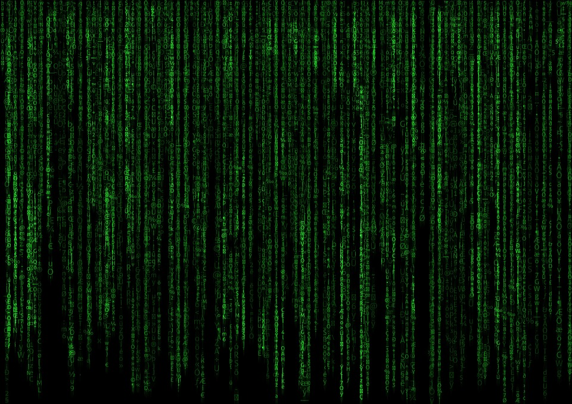

_Netflix tuottaa jättimenestyneitä sarjoja hyödyntäen data-analyysia. Sen kehittämät algoritmit kykenevät ennustamaan elokuville annetut arvostelut._

Onko kaiken luovan työn nyt syrjäyttämässä valtavia datamääriä hyödyntävät oppivat koneet? Luoko data science ennennäkemättömät mahdollisuudet ennustaa ja toteuttaa ihmisten toiveet?

Data science on kuumaa kamaa, sillä tällä nimikkeellä [perustetaan nyt laitoksia tunnetuissa yliopistoissa](http://www.r-statistics.com/2016/01/50-years-of-data-science-by-david-donoho/), kuten UC Berkeley, NYU, MIT ja Univ. of Michigan. Data science, koneoppiminen ja big data ovat myös erittäin seksikkäitä termejä nykyajan yritysmaailmassa.

Harva on vielä selvillä siitä, onko data science aidosti uusi tieteenala, joka tulee ratkaisemaan monia tieteellisiä ja kaupallisia ongelmia, vai "vain" uudelleen brändättyä tilastotiedettä. Varmaa on kuitenki se, että useat ison profiilin firmat hyödyntävät tällä hetkellä menestyksekkäästi ja näkyvästi data-analyysia ja tilastollisia menetelmiä.

Hyvänä esimerkkinä tästä on Netflix, joka on kehittänyt ennustavia algoritmejaan avoimien kilpailujen kautta ja suunnitellut televisiosarjoja hyödyntäen data-analyysia.

Vuonna 2006 Netflix järjesti kilpailun elokuvasuosittelu-algoritminsa kehittämiseksi. Kilpailussa algoritmin suosittelukykyä arvioitiin kykynä ennustaa mahdollisimman lähelle ihmisten todellisuudessa antamia arvosteluja, jotka netflixissä annetaan asteikolla 1-5.

Tavoitteena oli nostaa ennustustehokkuutta kymmenellä prosentilla - eli pienentää käytössä olleen algoritmin keskimääräistä virhettä vastaavasti. Ensimmäinen tämän saavuttanut kilpailija tai joukkue voittaisi pääpalkinnon: miljoona dollaria.

**Kilpailua** varten tarjottiin aineisto, jonka harjoitteluosa sisälsi seuraavat tiedot: käyttäjä, elokuva, arvostelu, päivämäärä. Netflix säilytti itsellään pienemmän samanlaisia tietoja sisältävän testiosan, jonka perusteella kilpailun voittajat ratkaistiin ja kilpailun edistymistä seurattiin. Tavoitteena oli harjoitteluaineiston perusteella oppia ennustamaan testiosan arvosteluja.

Tämä on tyypillinen asetelma koneoppimisen menetelmille.

Ongelma voidaan tässä asetelmassa pyrkiä kuvaamaan matemaattisella mallilla, jonka tarkoituksena on ennustaa ihmisten tulevia arvosteluja käyttäen hyödyksiä saatavilla olevia tietoja. Algoritmit voidaan ohjelmoida oppimaan mallin tuntemattomat osat - mallin parametrit. Erilaisia malleja voidaan myös luontevasti vertailla: paras malli on se, joka ennustaa tuntematonta aineistoa parhaiten.

Tällainen malli voi aivan hyvin olla perinteisessä tilastotieteessä paljon käytetty lineaarinen malli, jonka parametrit algoritmi oppii datasta. Oppivia algoritmeja ja menetelmiä on kuitenkin paljon erilaisia.

**Netflixin** alkuperäinen suosittelualgoritmi Cinematch [perustui lineaarisiin malleihin](http://www.netflixprize.com/faq).

Cinematchin ennustuskyky päihitettiin jo muutaman päivän jälkeen kilpailun alkamisesta. Vuoden kuluttua kilpailun paras algoritmi [oli ennustusteholtaan jo yli 8% Cinematchia parempi](http://www.netflixprize.com/community/viewtopic.php?id=799). Lopulta miljoonan dollarin palkintoon vaadittava raja saavutettiin vuonna 2009. Kolme joukkuetta yhdisti voimansa ja kehitti yhdessä algoritmin, joka [paransi Cinematchin ennustustehoa 10.06%](http://www.netflixprize.com/community/viewtopic.php?id=1537).

Miten hyvä nykyinen ennuste sitten on? Keskimäärin noin 0.86 yksikköä pielessä. Selvästikään algoritmi ei siis vielä täysin ymmärrä ihmisten mieltymyksiä.

**Netflix** hyödyntää käyttäjiltään keräämäänsä dataa myös päätöksissään tuottaa sarjoja. Kuuluisa esimerkki tästä on menestyssarja House of Cards. House of Cards on alunperin BBCn minisarja, johon Netflix osti oikeudet, sillä siinä yhdistyi elementtejä joista heidän käyttäjänsä saattaisivat pitää.

Nämä elementit tunnistettiin data-analyysin avulla.

Lisäksi Netflix kiinnitti projektiin ohjaajan, jonka elokuvat olivat erityisen pidettyjä heidän käyttäjiensä keskuudessa. Pääosan näyttelijä valikoitui samoin. Netflix siis osti konseptin, jonka osista heidän käyttäjänsä tunnetusti pitivät ja kiinnitti siihen tekijät, joiden töitä heidän käyttäjänsä mielellään katselivat.

Resepti oli jättimenestys.

Kuitenkin on selvää, että data-analyysi toimi vain yhtenä työvälineenä luovassa projektissa. Lopulta House of Cardsin tekemiseen vaadittiin ihmisten inhimillistä työtä.
