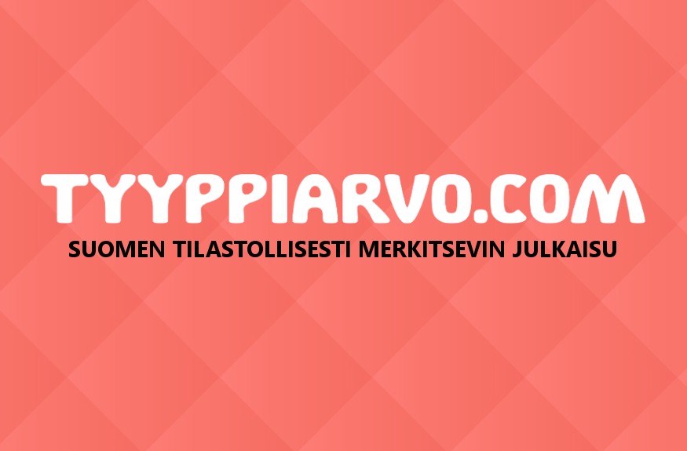

Eräänä joulukuisena iltapäivänä Helsingin yliopiston Kumpulan kampuksella heitettiin ilmaan ajatus: mitä, jos Tyyppiarvo alkaisi ilmestyä netissä?

Nyt, noin kaksi kuukautta tuon joulukuisen tiistain jälkeen, Tyyppiarvo.com on avattu.

Tyyppiarvo.com-sivustolla jutut on jaettu neljään ryhmään: Tilastotiede-kategoriassa käsitellään tieteenalan ajankohtaisia ilmiöitä, Tyypilliset kertoo ainejärjestö Moodin tapahtumista ja Moodin Palloseuran otteluista. Henkilöt & Lifestyle esittelee moodilaisia ja muita tilastoihmisiä, ja Blogit-osiossa ääneen pääsevät lehden blogistit.

Tyyppiarvon päätoimittajaksi valittiin joulukuussa 2015 ensimmäisen vuoden tilastotieteen opiskelija **Aapeli Nevala**, joka on ennen tuloaan Helsingin yliopistolle työskennellyt muun muassa Satakunnan Kansassa, Lapin Kansassa ja Ilta-Sanomissa.

Uusi Tyyppiarvo tarkoittaa Nevalan mukaan ajankohtaisempaa kerrontaa ja uusia esitystapoja.

\- Tilastotiede on Suomessa vähän pimennossa, vaikka se mahdollistaa kaikenlaista. Tyyppiarvon tarkoitus on tuoda tilastotiede paremmin näkyville. Olisi upeaa nähdä suomenkielinen, Suomeen keskittyvä versio FiveThirtyEightista. Me emme voi olla se koko ajan, mutta meillä on potentiaalia 538-tyylisiin väläytyksiin, Nevala sanoo.

\- Verkkojulkaisu mahdollistaa paitsi ajankohtaiset kuvaukset Moodin tapahtumista, myös erilaiset esitystavat. Tilastotieteen opiskelijoilla on paljon teknistä osaamista, jota on helppo hyödyntää juuri verkkosivun kautta.

**Moodin** puheenjohtajaksi valittu **Tommi Mäklin** oli mukana päättämässä, että lehden ilmestymiskertoja harvennetaan, mutta samalla luodaan verkkoon sivusto, jonne Moodin tapahtuman ja tilastotieteen ajankohtaiset asiat päivittyvät reilusti nopeammin. Painettu Tyyppiarvo ilmestyy tästä lähtien molempien lukukausien alussa.

\- Tyyppiarvon kauan odotettu verkkoon siirtyminen kuvastaa uuden hallituksen kykyä rohkeisiin irtiottoihin perinteistä, Mäklin sanoo.

Nevala korostaa myös ainejärjestön toiminnasta kertomisen tärkeyttä.

\- Moodi on elävä järjestö, jolla on paljon tapahtumia. Moodin tapahtumista kertominen on hyvä tapa näyttää myös ulospäin, että tilastotieteen opiskelu on muutakin kuin kahvinjuontia ja hikoilua Exactumin eri kerroksissa.

Mukaan Tyyppiarvon verkkoprojektiin lähtivät Moodin web- ja design -vastaava **Joni Oksanen** sekä Tyyppiarvon kukoistukseen 2013 nostanut emerituspäätoimittaja **Tuomo Nieminen**. Niemisen päätoimittajakauden aikana HYY valitsi Tyyppiarvon Helsingin yliopiston parhaaksi järjestölehdeksi.

 

**Tyyppiarvon** digitalisoituminen alkoi jo 2013, jolloin lehden ulkoasu uudistettiin ja näköispainosta alettiin julkaista netissä. Myös sisällöllisesti lehteä suunnattiin ulospäin ja jakelukanavia uudistettiin, vakituistettiin ja tehostettiin.

\- Aapelin pyytäessä minua uudestaan mukaan Tyyppiarvon pariin oli päätös helppo. Aapeli on inspiroivan innokas ja selvästi tietää, mitä on tekemässä. Hän haluaa lehdeltä samoja asioita kuin minäkin, ja aloite tyyppiarvo.comin perustamisesta tuntui oikealta heti alusta alkaen, nyt Tyyppiarvon uutispäällikkönä toimiva Tuomo Nieminen sanoo.

Nevalan ja Niemisen molempien mielestä tilastotieteen opiskelijoilla on paljon annettavaa Tyyppiarvon lukijoille.

\- Opiskelijoista löytyy ainutlaatuista osaamista, joka mahdollistaa esimerkiksi data-analyysin tutkivassa journalismissa, Nieminen sanoo.

Tervetuloa mukaan tilastotieteen kauniiseen maailmaan!
