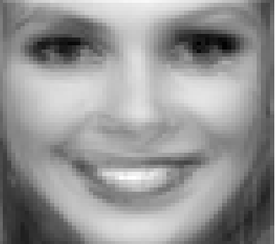

Tyyppiarvon toimituksen ydin kokoontui eräänä helmikuisena iltapäivänä pohtimaan vastausta mieltä raastavaan kysymykseen: Miten ennustaa missikisojen voittaja? Mikä on keskivertomoodilaisen mahdollisuus voittaa Miss Suomi -kilpailu?

Tähän ongelmaan kehitettiin pettämättömän tieteellinen Tyyppiarvon missivertailualgoritmi, jonka sivutuotteena aikaansaatiin suomalaista mielenmaisemaa järkyttävä tulos: aito ja autenttinen kuva keskimääräisestä 2000-luvun Miss Suomesta!

_Tältä näyttää 2000-luvun keskimääräinen Miss Suomi._

Vertailun suorittamiseksi tarvittiin aineistonkeruu. Tilastollisesti merkittävää analyysiä ei tehdä sormilla laskettavissa olevilla otoskoilla, mutta  missit vuosilta 2000-2012 -  eli 13 kuvaa - riittivät tähän analyysiin hyvin.

Aineistonkeruuseen ryhtyi Tyyppiarvon uutispäällikkö **Tuomo Nieminen**, joka käytti useita öitä missien kuvien katseluun.

Toimituksen kofeiinipäissään junailema juttuidea törmäsi kuitenkin tässä vaiheessa melkein ylitsepääsemättömään esteeseen: kuinka verrata missejä toisiinsa täysin objektiivisesti ja toisistaan riippumattomasti? Kuka toimituksesta osaa tehdä kuva-analyysiä vapaavalintaisella ohjelmointikielellä?

Onneksi paikalla sattui olemaan Moodin puheenjohtaja **Tommi Mäklin**, joka lykkäsi kiireisiä puheenjohtotehtäviään ja prokrastinaation antamin yli-inhimillisin voimin toteutti tilastotieteilijän uran ehdottomiin huippukohtiin kuuluvan Tyyppiarvon suuren missianalyysin.

Analyysi toteutettiin Helsingin katukuvassa lähinnä kioskina tunnetulla R:llä. R on avoimen lähdekoodin tilasto-ohjelmisto, johon  löytyy lisäpaketti jokaiseen mahdolliseen ja mahdottomaan data-analyysitehtävään.

"Yllättäen" siis löytyi myös paketti 64x64 harmaasävyisten png-kuvien lataamiseen matriisimuodossa. Näin saatiin missikuville yksinkertainen matemaattinen esitys, jossa jokaista kuvan yksittäistä pikseliä vastaa sen harmaasävyä kuvaava numero.

Tämän jälkeen 13 kuvasta koostuva missitietokanta yhtenäistettiin vastaamaan data-analytiikan  laatustandardeja, jolloin vain Wikipedian kuva-analyysistä kertovien artikkelien sisältö oli rajana 2010-luvun merkittävimmän analyysin toteuttamiselle.

Vertailtuaan erilaisia menetelmiä, taitava analytiikkatiimimme päätyi lopulta eksoottiseen valintaan: missikuvista laskettiin pikselittäin keskiarvo. Keskiarvomatriisi muunnettiin sitten takaisin harmaapikseleiksi, jolloin saatiin tuotettua kansan keskisyviin riveihin uppoava kuva: keskiarvomissi.

Lähiviikkoina Tyyppiarvo.comissa on luvassa lisää analyysia misseistä.

_Lisäys 5.3. klo 13:30_

Tilastotiedettä hyödynnetään yleisesti myös kuvanmuokkauksessa. Alla versio missikuvasta, jossa on esimerkiksi lisätty kuvaan osittain satunnaista informaatiota - tuloksena tasaisempi kuva!

_Kuvan muokkaus: Seppo Toikka_
