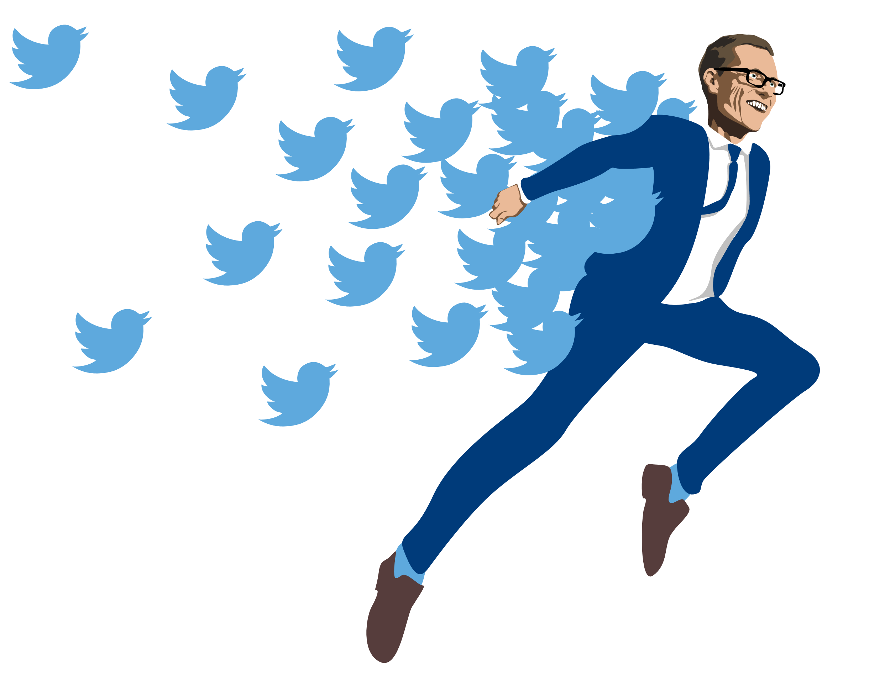
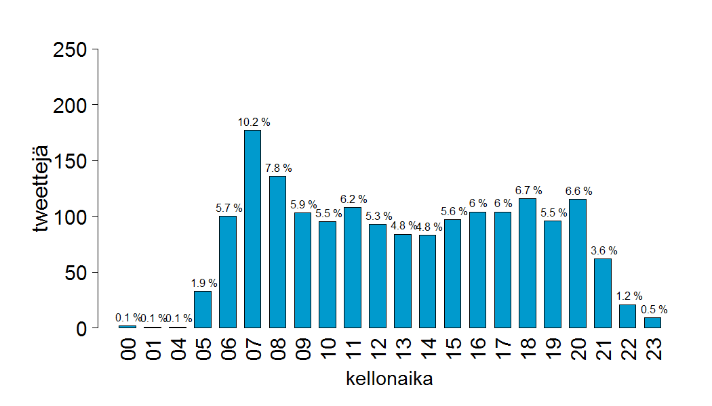
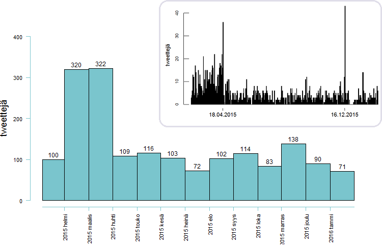
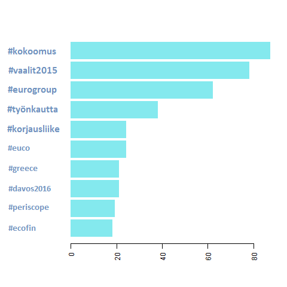
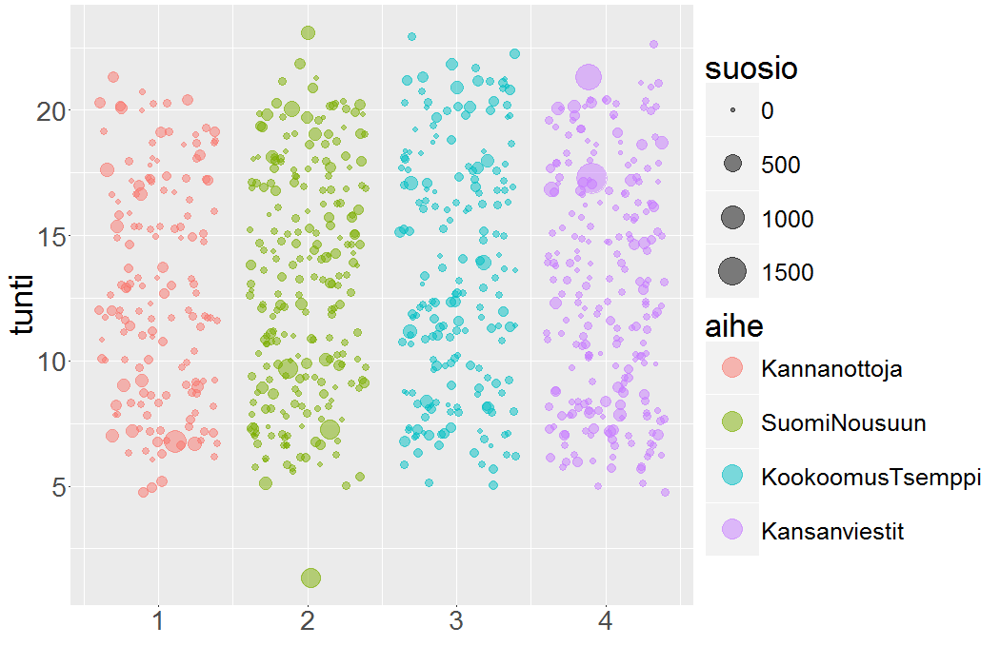
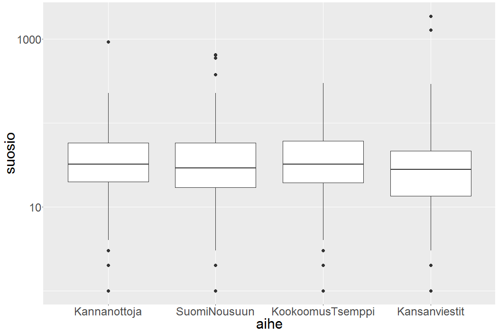
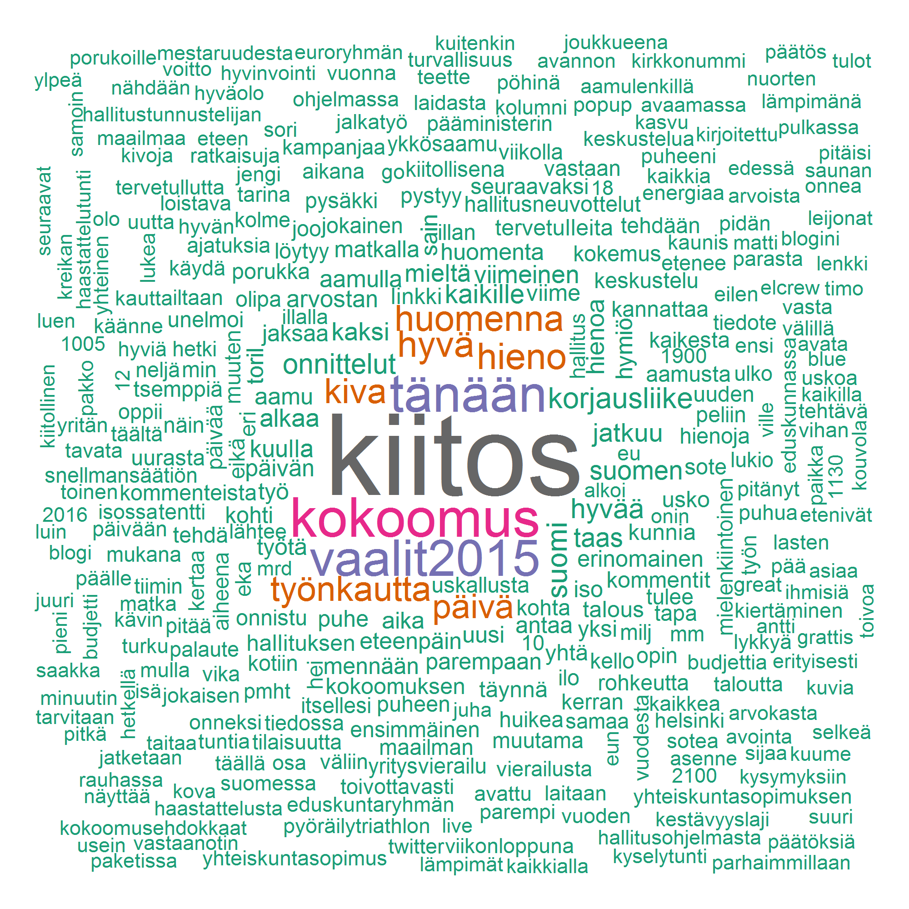

* * *

Kansikuva: **Heikki Ritaluoma**

Teksti, kuvat ja analyysit: **Tuomo Nieminen**

Kaikki tietävät, että **Aleksander Stubb** twiittaa paljon. Itseasiassa ministeri Stubbin twiitit ovat niin paljon esillä perinteisessäkin mediassa, että twitterin ulkopuolinenkin tietää jotain niiden sisällöstä.

Good raw porridge, good morning session with wattbike. Kokoomus on rohkeuttalaittaa itsensä likoon, joka ainoa päivä. Ja niin edelleen.

En seuraa twitteriä ollenkaan, mutta halusin tietää lisää Stubbin twiiteistä. Milloin Stubb twiittaa? Mistä aiheista Stubb twiittaa? Kuinka suosittuja Stubbin twiitit ovat? Twitter tarjoaa onneksi ohjelmointirajapinnan, joten pikaisen haxeroinnin jälkeen hallussani oli 1740 Stubbin twiittiä ajalta 14.2.2015 – 19.2.2016. Tämä vastaa melkein viiden twiitin päivätahtia.

Aloitetaan ajankohdasta: milloin Stubb twiittaa?

Stubb on twitterissä melko aamuvirkku, mutta twiittejä lähtee kuitenkin tasaisesti pitkin päivää.

_@alexstubb twiittien jakaantuminen kellonajan mukaan. Aktiivisin twiittaustunti on kello 7:00 - 8:00._

Aktiivisista twiittausaikaa on 06:00 – 22:00, eli oletettavasti koko ministerin hereilläoloaika. Eniten twiittejä Stubb lähettää aamulla seitsemän ja kahdeksan välissä: hieman yli 18% Stubbin twiiteistä on lähetetty ennen kello kahdeksaa. Stubbilla on välillä painavaakin asiaa heti aamusta.

> ”Rasistisia ja uhkaavia mielenimaisuja ei oikeuta mikään. Ei koskaan. Ei missään olosuhteissa. Tuomitsen jyrkästi.” - @alexstubb 25.9.2015 klo 07:11

Ehkäpä tasaisella strategialla pyritään voluumin maksimointiin? Stubb on kuuluisa siitä, että välillä hänen twitter-aktiivisuutensa on aivan omaa luokkaansa.

Viime vuoden joulukuussa Stubb twiittasi yhden päivän aikana yli neljäkymmentä kertaa jonkinlaista tajunnanvirtaa kokoomuksen syvimmästä olemuksesta. Myöhemmin kävi ilmi, että kyseessä oli Stubbin pitämä puhe, josta tämän avustaja twiittasi 140 merkin katkelmia.

Aineisto näyttää, että tuo kyseinen päivä, eli 16.12.2015 oli harvinaisen aktiivinen päivä, muttei kuitenkaan täysin ainutlaatuinen. Stubb twiittasi esimerkiksi vaaleja edeltävänä päivänä 18.4.2015 kolmekymmentäkuusi kertaa.

_@alexstubb twiittien kuukausittaiset ja päivittäiset lukumäärät. Stubb twiittasi huomattavasti enemmän eduskuntavaaleja edeltäneinä kuukausina helmi- ja maaliskuussa 2015. Kaksi päivistä erottuu joukosta harvinaisen aktiivisina._

> ”Rakas Suomi, huomenna on demokratian juhlapäivä. Toivottavasti löydät itsellesi sopivan ehdokkaan. Kiitos kaikesta.” - @alexstubb 18.4.2015 klo 20:34

Vaaleja edeltäneinä kuukausina Stubb oli poikkeuksellisen aktiivinen: Stubb twiittasi noin kolme kertaa enemmän helmi- ja maaliskuussa 2015, kuin sen jälkeisinä kuukausina. #vaalit2015 on myös yksi Stubbin käytetyimmistä hashtageista tarkastellulla aikavälillä. Superpäivä 16.12.2015 tuli puolestaan täysin puskista.

Jo pelkästään tarkastelemalla Stubbin käytetyimpiä hashtageja on selvää, että Stubbin twiittien sisältö on poliittista. Suomenkieliset hashtagit ovat kärjessä, mutta Stubb twiittaa myös paljon englanniksi. Hashtagien top-10:stä löytyy esimerkiksi #greece ja #ecofin.

_@alexstubb käytetyimpien hashtagien esiintymisfrekvenssit._

Oman puolueen hashtag on komeasti ykkössijalla ja top-vitosessa on muita selkeän stubbmaisia hashtageja: #työnkautta, #korjausliike.

Ennakkoluuloni Stubbin twiiteistä oli, että ne ovat positiivisia ja sisällöltään suhteellisen tyhjiä. Eniten käytetyt hashtagit eivät tätä mielikuvaa oikeastaan vahvista, mutta toisaalta #kokoomus –tagin takana voi varmasti sanoa kaikenlaista.

Hashtagit antavat osviittaa twiittien aiheista, mutta eivät kuitenkaan paljasta twiittien todellista sisältöä. Turvauduinkin tässä vaiheessa tilastollisiin menetelmiin.

Erottelin aineistosta suomenkieliset twiitit ja jaoin ne neljään aiheeseen käyttäen aihemallinnusta (topic modelling). Aihemallinnus on niin sanottu repullinen hittejä -menetelmä (bag of words). Tarkasteltavana yksikkönä ovat sanat ja menetelmän ideana on, että saman aiheen sanat esiintyvät erillään muiden aiheiden sanoista.

Kun sanat on jaettu aiheisiin voidaan palata tarkastelemaan alkuperäisiä dokumentteja, eli tässä tapauksessa twiittejä.Mikäli halutaan valita kullekin twiitille yksi aihe, on luonnollinen valinta se aihe, mistä suurin osa twiitin sanoista on.

Aiheiden lukumäärä (4) oli kokeiluihin perustuva subjektiivinen valinta. Etukäteen oletin mallin selkeästi kykenevän erottelemaan henkilökohtaisemmat, esimerkiksi harrastuksia käsittelevät twiitit poliittisista viesteistä. Näin ei kuitenkaan aivan käynyt. Tarkasteltuani aiheisiin jaettujen twiittien sisältöä, totesin seuraavat nimet kuvaaviksi:

- aihe 1: Kannanottoja
- aihe 2: Suomi nousuun
- aihe 3: Kokoomus-tsemppi
- aihe 4: Kansanviestit

**Kannanottoja**\-kategoriaan kuuluu erityisesti arvoihin liittyviä viestejä. Tätä kategoriaa kuvaavat esimerkiksi seuraavat suositut twiitit:

> ”Lasten harrastukset lähtevät usein lapasesta. Liikaa ja liian vakavasti yhtä lajia liian nuorena. Pitäisi olla monipuolista ja kivaa.” - @alexstubb 30.4.2015 klo 7:06
> 
> “Hyvää isänpäivää kaikille. On se vaan niin hienoa saada olla isä. Olisinpa jonain päivänä yhtä hieno isä kuin omani. Nautitaan päivästä. “ - @alexstubb 8.11.2015 klo 7:16

**Suomi nousuun** twiitit ovat esimerkiksi talouspoliittisia ja kertovat ministerin näkemyksiä siitä, miten Suomen talous saadaan kuntoon.

> “Edessä isojen päätösten viikko: budjetti, yhteiskuntasopimus ja turvapaikanhakijat. Tekoja, ei sanoja. Päätöksiä, ei vatulointia.” - @alexstubb 7.9.2015 klo 7:28
> 
> ”Liikeaikalaki kumottiin. Lisää valinnanvapautta, edistää työllisyyttä ja tehostaa kilpailua.” - @alexstubb 15.12.2015 klo 10:21

**Kokoomus-tsemppi** sisältää esimerkiksi yrittäjyyttä ja yhteistä tekemistä hehkuttavia viestejä.

> “Kauppojen aukioloaikoja vapautetaan. Sääntelyä puretaan. Nyt etenee. Hyvä.” - @alexstubb 25.8.2015 klo 14:29
> 
> ”@hjallisharkimo puhuu asiaa yrittäjyydestä. Yrittäjä tietää mistä puhuu.” - @alexstubb 24.3.2015 klo 20:52

**Kansanviestit** sisältävät sisällöltään kevyitä ja yleisiä viestejä.

> ”On meillä taas huikea @aleijonat-jengi. Neljä nollapeliä putkeen. Joukkuehenki ja kuumat maalivahdit ratkaisee.” - @alexstubb 9.5.2015 klo 18:33
> 
> “Olipa hyvä päivä, ei mulla muuta” - @alexstubb 25.3.2015 klo 20:28

Kaikista aiheista löytyy twiittejä tasaisesti, eikä vuorokaudenaika näytä juurikaan vaikuttavan siihen, mistä aiheesta Stubb päättää twiitata. Entä twiitin suosio? Riippuuko se aiheesta? Mittasin twiitin suosiota retwiittien ja suosikki-painallusten yhteismäärällä.

_@alexstubb twiitit kellonajan, aiheen ja suosio mukaan. Stubb twiittailee kaikista aiheista tasaisesti pitkin päivää. Kansanviesteistä löytyy kaksi todella suosittua tweettiä._

Twiitin suosiossa on huima vaihtelu. Keskisuosio on noin 50, mutta muutamat harvat twiitit saavuttavat yli tuhannen suosiopisteen rajan. Mediaanisuosio on 29. Mediaani onkin suosion tapauksessa parempi jakauman keskipisteen mitta, sillä yksittäiset supersuositut twiitit vaikuttavat huomattavasti keskiarvoon.

| | keskimääräinen suosio | mediaanisuosio |
|--|--|--|
| Kannanottoja | 53 | 32 |
| Suomi nousuun | 50 |29 |
| Kokoomus-tsemppi | 45 | 32 |
| Kansanviestit | 51 | 27 |

Kokoomus-tsempin alhaisempi keskimääräinen suosio johtuu positiivisten outliereiden puutteesta. Toisin sanoen muissa aihessa esiintyi muutamia supersuosittuja twiittejä. Aiheella ei kuitenkaan voi katsoa olevan vaikutusta keskimääräiseen suosioon. Myös mediaanisuosiot ovat hyvin lähellä toisiaan

_Laatikkokuvat (box plot) suosion jakaumista aiheittain. Laatikon sisällä viiva merkkaa jakauman mediaanin. Muilla kuin Kokoomus-tsemppi-aiheisilla viesteillä on muutamia poikkeuksellisen suosittuja twiittejä. Kuvassa y-akselin asteikko on logaritminen._

Tilastollisen (regressio) analyysin perusteella ainoa tekijä, jonka havaittu vaikutus keskisuosioon johtuu hyvin pienellä todennäköisyydellä sattumasta oli se, onko twiitti vastaus jollekin toiselle käyttäjälle vai ei. Vastaustwiitittien suosio oli paljon alhaisempaa verrattuna ei-vastauksiin, mutta tämä ei liene yllättävää.

Voidaan kuitenkin spekuloida sillä, onko aiheella vaikutusta twiitin viraalisuuteen, eli riskiin tulla supersuosituksi. Kansanviestit on ainoa kategoria, josta löytyy yli tuhannen suosiopisteen twiittejä (2 kpl). Huikealla yli 1869 suosipisteellä johtoasemassa on twiitti, jonka Stubb kirjoitti mielenosoittajan heitettyä tämän päälle nestettä Tampereella.

> “Saa haastaa. Saa vaatia perusteluita. Saa olla eri mieltä. Kunnioitetaan kuitenkin toistemme koskemattomuutta. Hoidetaan asiat puhumalla.” - alexstubb 30.11.2015 klo 17:14

Aihemallinnus toi mielenkiintoisen tarkastelukulman ministeri Stubbin twiitteihin. Mallin kyky erotella aiheita toisistaan mielekkäällä tavalla on kuitenkin vielä jokseenkin kyseenalainen. Analyyseja olisi todennäköisesti mahdollista parantaa yksityiskohtaisemmalla aineiston esikäsittelyllä ja kokeilemalla myös toisenlaisia menetelmiä twiittien luokittelemiseksi. Ehkäpä tällöin myös erot suosiossa aiheiden välillä saataisiin näkyville.

Tällä hetkellä Stubbin twitteriä kuvaa parhaiten yksinkertaisempi menetelmä: Stubbin käytetyimmät suomenkieliset sanat.

_@alexstubb käytetyimmät suomenkieliset (asia)sanat._

* * *

Analyysit suoritettiin R-ohjelmistolla ja apuna käytettiin seuraavia kirjastoja:

- Aineiston haku ja käsittely: _twitteR, tm, stringr, textcat, data.table_
- Aihemallinnus: _topicmodels_
- Kuvat: _wordcloud, RColorBrewer, ggplot2_

Lisäksi: Tyyppiarvon automaattinen kolumnisti otti myös Stubb-aineiston haltuunsa ja [generoi itsestään valtiomiestason twiittaajan](../2016-03-22-automaattinen-kolumnisti-becoming-alexander-stubb/index.md).
