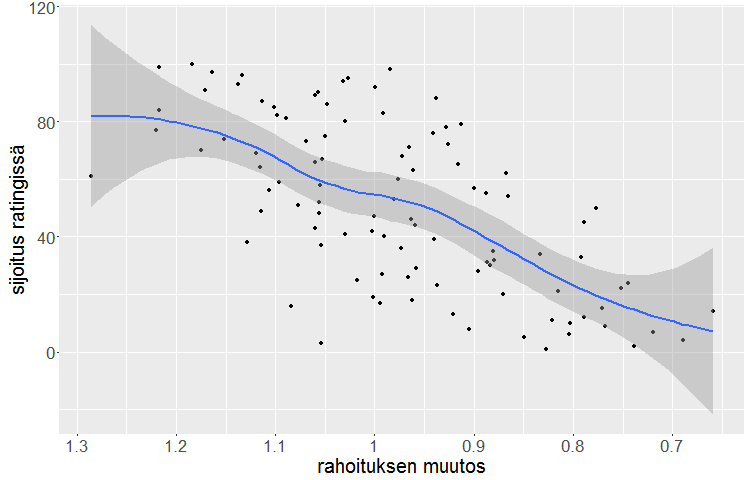

_Tämä juttu on julkaistu aprillipäivänä 1.4._

* * *

Helsingin yliopiston avajaisissa puhuneen **Juha Sipilän** hallitus on saanut runsaasti kritiikkiä yliopistoon kohdistuvista leikkaustoimista.

Avajaispuheessaan [Sipilä totesi](http://yle.fi/uutiset/sipila_puhui_helsingin_yliopiston_lukuvuoden_avajaisissa__sai_huutoa_osakseen/8267522), että niukkuudella voidaan saavuttaa yllättäviäkin tuloksia.

\- Pienemmillä resursseilla on jatkossa pystyttävä enempään ja parempaan. Monesti pienemmällä rahalla saa enemmän vaikuttavuutta. Omista kokemuksistani tiedän, että niukkuus luo myös luovuutta. Tämä on pitkälle asennekysymys, Sipilä sanoi.

Näille sanoille on naureskeltu yliopistopiireissä, mediassa, sosiaalisessa mediassa ja etenkin sosialistisessa mediassa pitkin hallitustaipaletta.

Tyyppiarvon tekemän selvityksen mukaan Sipilän puheet saattavat kuitenkin pitää paikkansa.

Yliopistojen paremmuutta objektiivisesti mittaavan Shanghai-rankingin perusteella vaikuttaa siltä, että suuret leikkaukset ja rahoituksen vähentäminen vaikuttavat keskipitkällä aikavälillä yliopistojen nousuun rankingissa.

_Juha Sipilä. Kuva: Wikimedia Commons._

**Tyyppiarvo** tutki kaikki sadan parhaan joukkoon rankingissa vuonna 2004 sijoittuneet yliopistot. Tutkimuksessa selvitimme rankingsijoituksen vuonna 2004 ja rahoituksen muutoksen vuosina 2004-2009.

Kävi ilmi, että kymmenen parasta yliopistoa ovat vakaasti rahoitettuja, mutta kolmenkymmenen parhaan yliopiston joukosta löytyy 12 koulutuslaitosta, joille on 5-10 vuoden aikajänteellä pidetty massiiviset, vähintään 15% rahoituksesta vievät leikkaukset.

Huomattavaa on, että näistä laitoksista kymmenen on noussut 30 parhaan yliopiston joukkoon ensimmäistä kertaa vasta leikkausten jälkeen.

Paras esimerkki on yhdysvaltalainen Northwestern University, joka menetti 25 prosenttia rahoituksestaan, mutta ponnisti sadan parhaan yliopiston ulkopuolelta Shanghai-rankingin sijalle 27 vain kahdeksan vuotta leikkausten jälkeen.

 

_Kuvaaja osoittaa, miten voimakas rahoituksen lasku parantaa sijoitusta. X-akselilla vuoden 2014 prosenttiosuus suhteessa vuoden 2004 rahoitukseen, Y-akselilla yliopiston sijoitus Shanghai-rankingissa. Grafiikka: Tuomo Nieminen._

**Vuosina** 2004-2014 rahoitusta lisänneistä yliopistoista suuri osa on puolestaan pudonnut pois rankingin sijoilta 10-30. Kymmenen vuoden aikajänteellä rahoitustaan kasvattaneista 16 yliopistosta enää kaksi on mukana top-30:ssä, ja Kioton ja Toronton yliopistotkin ovat pudonneet sijoilta 11 ja 14 sijoille 24 ja 25.

Hämmästyttävää on se, ettei yksikään sadan parhaan joukossa vuonna 2004 ollut yliopisto, jonka rahoitus on pudonnut merkittävästi, ole menettänyt yli kolmea sijaa rankingissa. 57:stä yli 15% leikkausten kohteeksi joutuneesta yliopistosta hämmästyttävät 52 on nostanut sijoitustaan.

Asian selittäminen tuntuu hankalalta ja asiaa pitää ehdottomasti tutkia enemmän, mutta Tyyppiarvon keräämän massiivisen datan perusteella näyttää siltä, että Sipilän lausahdus "niukkuus luo myös luovuutta" ei ole vain tyhjää sanahelinää.

Tätä tukee myös se fakta, että vaihtuvuus yliopistorankingien kymmenen parhaan ulkopuolella onk ollut suurta. Käytännössä näyttää siltä, että korkealle rankingissa pääsevät yliopistot saavat helposti lisärahoitusta, mikä puoluestaan pudottaa yliopistot pian takaisin matalemmille sijoituksille.

Optimaalinen strategia voisi olla venyttää yliopistojen taloudellista sietokykyä vielä hieman lisää, jolloin niukkuuden tuottama luovuus pääsee todella kukoistamaan.

[Yliopistojen Shanghai-ranking](http://www.shanghairanking.com/ARWU2015.html)

[Tyyppiarvon massiivinen tutkimus Google Drivessä.](https://fi.wikipedia.org/wiki/Aprillipäivä)
