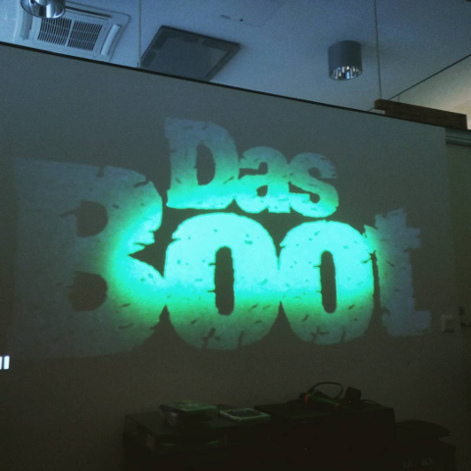
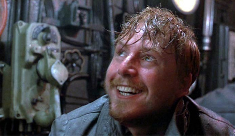

<!-- Kapteeni Thomsen oli lyhyestä roolistaan huolimatta yleisön suosikkihahmo.-->

Sateinen huhtikuun lauantai. Palelen sisätiloissa. Sateenvarjoa ei näy, ja olen joka tapauksessa myöhässä. Tekee mieli jäädä ihailemaan vastapäisen talon kaunista pystytiilipäällystettä ja vihreää kuparikattoa likaisesta ikkunasta, mutta ajatus ilmaisista eväistä on vastustamattoman houkutteleva. Olotila on täydellinen viiden tunnin erikoispitkän leikkauksen Wolfgang Petersenin klaustrofobisesta sukellusvenedraamasta [Das Boot (1981)](http://www.imdb.com/title/tt0082096/) katsomiseen.

Saapuessani ei lainkaan elokuvateateriksi sopivaan Domus Gaudiumin Matlu-klusterin kerhohuoneeseen huomaan olevani se viimeinen, jota muut taas odottivat. Hups. En muista pahoitella, vaan valtaan tilan parhaan paikan ja korkkaan asiaankuuluvasti saksalaisen laatulagerin käteni hakeutuessa kohti viinirypäleastiaa. Elokuvan luotaantyöntävän vihreä logo heijastuu harmaanvalkoiselle seinälle, ja noin viisihenkisestä katsomosta kuuluu ilonhuuto: “Tätä on odotettu!”

Das Boot on hämmentävän hienosti odottamista ja turhautumista kuvaava elokuva. Toisen maailmansodan sukellusvenesodankäyntiä kuvaava ja kriitikoiden rakastama pätkä on kerrottu veneelle mukaan lähtevän sotakirjeenvaihtaja Luutnantti Wernerin näkökulmasta, jonka tietämys elokuvan päätähden, sukellusvene U-96:den, ei ylittäne valistuneen katsojan vastaavaa. Wernerin elokuvan aikana kirjoittama päiväkirja alkaa innostuneen optimistisesti ja muuttuu tarinan junnatessa paikallaan yhä ankeammaksi ja kyynisemmäksi aivan kuten veneen miehistön tarinakin.

Elokuvan ensimmäiset kolme tuntia vietetään alun “elokuvahistorian parhaan bilekohtauksen”, jonka stereotyyppiset humalaiset Moodin raati onnistui yksimielisesti yhdistämään jäsenistöön, jälkeen paneutuen sukellusvenemiehistön päivittäiseen elämään, joka käsittää lähinnä säilykkeiden syömistä ja harvinaisen huonoa huumoria piristettynä satunnaisella veneen päästä päähän juoksemisella. Das Bootin toimintakohtaukset lienee mahdollista tiivistää alle kymmeneen minuuttiin, mutta massiivisen pituinen viiden tunnin leikkaus onnistuu kaappaamaan mukaansa apatiaan ja ensimmäistä väliaikaa edeltävät kaksi tuntia kuluvat kuin siivillä.

_Martin Semmelroggen esittämä veneen 2. perämies._

Olen aikaisemmin katsonut elokuvasta kolmituntisen director’s cut -version ja odotin kauhunsekaisella innolla miten viihdyttävän tylsää pätkää voi venyttää vielä kahdella tunnilla. Viisituntinen versio tekee vaikutuksen erinomaisen onnistuneella leikkauksellaan: elokuvan aikana en huomannut minkään kohtauksen erottuvan joukosta, vaan koko kaksituntinen lisämateriaali sopii sekaan aivan kuin se olisi ollut siellä aina. Viiden tunnin leikkaus Das Bootista on elämys.

Väliajalla suoritetun eväs- ja kofeiinitäydennyksen jälkeen on aika palata hämyiseen metalliputkeen Atlantin valtamerellä. Jälkimmäiset kolme tuntia sisältävät hieman vähemmän odotusta kuin väliaikaa edeltänyt puolisko, mutta miehistön turhaantuminen on joka tapauksessa käsin kosketeltavaa ja onnistuu taas hiljentämään yleensä niin äänekkään yleisön. Sukellusveneen keinuessa myrskytuulissa eräs katsoja joutuu poistumaan yllättäen iskeneen merisairauden vuoksi - meriitti sekin elokuvan vetovoimalle.

<!-- Luutnantti Werner nauttii myrskystä.-->

Lopun hiljalleen ja elokuvan tyyliin sopivasti nouseva tempo huipentuu kohtaukseen Gibraltarin salmella, josta kirjoittaminen lienee liian paljastavaa teosta näkemättömille. Kuitenkin Das Bootin kantava teema odottaminen ja voimattomuuden tunne säilyy tiiviimmissäkin kohtauksissa ja huipentuu ehkä hieman yllättävään loppuun, joka herättänee ajatuksia hilpeämmässäkin katsojassa.

Alkuperäisestä saksalaisesta minisarjasta leikattu viiden tunnin versio Das Bootista on ehdottomasti elokuva, joka vähänkään draaman päälle ymmärtävän kannattaa joskus katsoa. Tunnelman luomisessa klusterin kerhotila tosin epäonnistui täysin: pleksilevyn takaa paistavat lamput ja mukavan väljän istumisen mahdollistava steriili 2000-luvun tila eivät oikein sovi hämärän 50m x 3m teräsputken luomaan klaustrofobiseen miljööseen.

Suosittelenkin katsomaan elokuvan ennemmin jossain valtsikan kuppalaa vastaavassa ympäristössä, eli pimeässä, ahtaassa ja kosteassa kellarissa, jollaista myös U-96 lienee enemmän muistuttanut.
