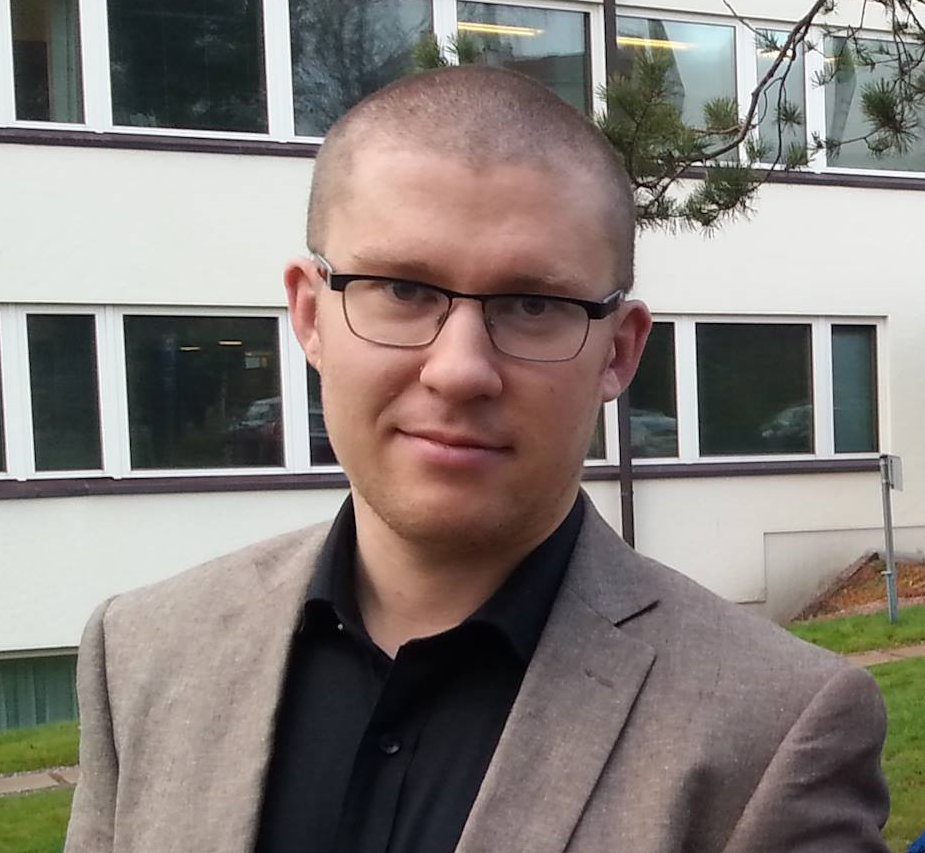

_Jussi Tervola siirtyi valtiotieteelliseen tiedekuntaan lukemaan tilastotiedettä vuonna 2007. Hän tekee väitöskirjaa maahanmuuttajista ja Suomen sosiaalipolitiikasta. Tänä keväänä Tervola on ollut vierailulla Tukholman yliopiston väestötieteen tutkimusyksikössä, missä hän tekee vertailevaa tutkimusta Suomen ja Ruotsin perhevapaajärjestelmistä maahanmuuttajien näkökulmasta._ 

* * *

Minua pyydettiin kirjoittamaan työelämäblogiin tähänastisesta työ- ja opiskelijaurastani. Aluksi on hyvä kertoa, että olen vieläkin oikeastaan opiskelija, tarkemmin yhteiskuntapolitiikan jatko-opiskelija. Samalla olen töissä tutkijana Kelan tutkimusosastolla.

Alussa oli matematiikka. Kun aloitin lukemaan matematiikkaa tuoreella Kumpulan kampuksella vuonna 2005, tiesin, että se pysäkki on hyvin todennäköisesti väliaikainen. Matematiikka oli jollain tasolla intohimoni, mutta toisaalta puhdas matematiikka tuntui tyhjältä ja todellisuudelle vieraalta. Siitä lähtien olenkin enemmän tai vähemmän päämäärätietoisesti siirtynyt kohti substanssia eli sisältöä.

Vuonna 2007 siirryin Valtsikan puolelle tilastotieteeseen. Vaihto soveltavaan tiedekuntaan tuntui jo aimo harppaukselta kohti sisältöä. Se helpotti mm. sivuaineiden lukemista sosiaalitieteistä. Valitsin pitkän sosiologian, joka osoittautui hyväksi valinnaksi. Tosin nyt sanoisin, ettei taloustiedekään olisi ollut pahitteeksi.

Tilastotieteen opiskeluaikana tein tyypillisiä opiskelijan töitä varastolla. Opintojen loppuvaiheessa aloin tehdä myös oman alan töitä, pieniä data-analyysikeikkoja, joista osan löysin Moodin sähköpostilistalta. Isoin niistä oli kolmen kuukauden työharjoittelu Helsingin sosiaalivirastossa kyselytutkimuksen parissa. Tehtäväni oli analysoida ja raportoida Helsingin kuljetuspalvelun asiakaskyselyn tulokset.

Siitä, miten pääsin yhä enemmän substanssin pariin, saan kiittää tilastotieteen professori Risto Lehtosta (kiitos Risto!). Kyselin häneltä mahdollisuutta gradun tekemiseen harjoittelupaikassa ja hän ehdotti Kelan tutkimusosastoa, josta löytyikin tilausta gradututkimukselle. Valmistuttuani maisteriksi sain tutkijan vakanssin samasta paikasta. Tehtävänäni oli olla mukana ohjelmoimassa mikrosimulointimallia, jolla voitaisiin simuloida eri verotus- ja sosiaaliturvalainsäädännön vaikutuksia.

Kun mietin käymiäni tilastotieteen kursseja, niin ehkä hyödyllisin minulle on ollut yleistetyt lineaariset mallit. Kurssi oli melko laaja ja siksi pintapuolinen, mutta tärkeät perusideat ja käsitteet tulivat tutuksi. Toinen kurssi, joka olisi varmaan ollut hyödyllinen, mutta jota en sattunut ottamaan, on lineaaristen mallien sovellukset.

Se, mitä jäin ehkä opinnoiltani kaipaamaan oli kurssi kausaliteetista. Sosiaalitieteissä ollaan monesti kiinnostuneita asioiden välisistä syy-seuraus-yhteyksistä. Monet ovat varmasti kuulleet, että korrelaatio ei ole kausaatio ja jäätelön syönti ei aiheuta hukkumiskuolemia, vaikka ne korreloivat kuukausittain. Kausaliteetin tutkimista ei tilastotieteen laitoksella opiskeluaikanani tietääkseni opetettu. Nyt täällä Tukholmassa minulle tuli onneksi mahdollisuus käydä kurssi aiheesta. Nyt kun vilkaisin Helsingin yliopiston kurssitarjontaa, asia näyttää korjaantuneen. Siellä näytti olevan mielenkiintoiselta kuulostava kurssi ”Statistical Methodology For Researchers”, jossa käydään läpi myös kausaliteetin tutkimista.

Viimeisin askeleeni kohti sisältöä tuli vuonna 2014, kun ryhdyin työpaikan kannustamana yhteiskuntapolitiikan jatko-opiskelijaksi. Väitöskirjani aiheena on laajasti sanottuna ”maahanmuuttajat ja Suomen sosiaalipolitiikka”. Tämän kevään olen ollut vierailulla Tukholman yliopiston väestötieteen tutkimusyksikössä kirjoittamassa vertailevaa tutkimusta Suomen ja Ruotsin perhevapaajärjestelmistä maahanmuuttajien näkökulmasta. Saattaa kuulostaa monen mielestä aika spesifiltä. Kokemus on ollut hyvin antoisa siitäkin syystä, että vaihto-opiskelu jäi väliin maisterivaiheessa. Olen huomannut myös, että tilastotieteen oppiminen on ikuisuusprosessi. Jokaista tutkimusartikkelia kirjoittaessa, ja varsinkin nyt Ruotsissa, olen oppinut aina jotain uutta.

Koen, että tilastotieteilijätaustasta on ollut paljon hyötyä nykyisessä pestissäni, jossa menetelmät ovat enää (tärkeässä) sivuosassa.
