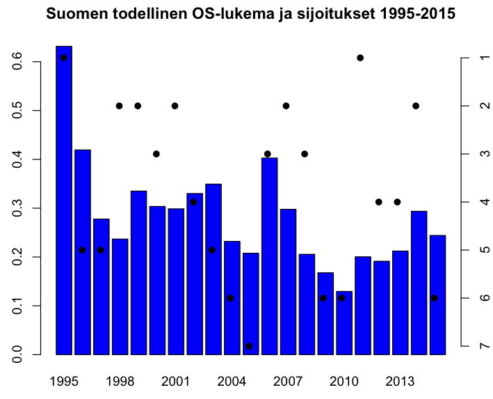

Kaikki tietävät, että jääkiekon MM-kisoissa ei aina pelaa maan paras miehistö. Tämän takia MM-kisojen taso heittelee ja kisojen voittamista voidaan pitää vaikeampana joinakin vuosina. Mutta milloin jääkiekon MM-turnaus on ollut kaikkein kovimmillaan?

Tyyppiarvon urheilutoimitus laski jokaiselle olympiamitalin Naganossa 1998 tai sen jälkeen voittaneen maan MM-miehistölle "OS" eli "Olympic Score" -lukeman, joka kertoo kyseisen vuoden MM-joukkueen kovuudesta.

OS-score kertoo, paljonko joukkue on saanut jalkeille parhaita pelaajiaan. Parhaat pelaajat ovat tässä niitä, jotka ovat pelanneet maan olympiajoukkueessa MM-kisoja "ympäröivien" olympialaisten aikana.

Laskemalla kaikkien maiden OS:t yhteen, saimme seuraavan kuvaajan:

Siis OS-laskemien mukaan modernin ajan parhaat MM-kisat pelattiin vuonna 2005. Tämä ei ole sinänsä yllättävää, sillä vuoden 2005 NHL:n työsulun ansiosta käytännössä kaikki pelaajat olivat vapaita osallistumaan MM-jäille.

Olympiavuosina OS-lukemassa näkyy pudotuksia varsinkin Kanadan ja Yhdysvaltojen joukkueissa. 2014-kisat olivat heikot.

Myös Suomen mestaruusvuonna 1995 pidetyt kisat olivat huonotasoiset. Tällä mallilla ennen vuotta 1998 ja vuoden 2014 jälkeen pelattujen kisojen arviointi on kuitenkin vaikeampaa, sillä 1994 olympialaisia ei otettu huomioon (ammattilaiset eivät pelanneet Lillehammerissa) ja 2018 olympialaisia ei ole, yllätys yllätys, vielä pelattu. Näinä vuosina kisojen taso on arvioitu pelkästään 1998 tai 2014 olympialaisten perusteella.

Muita kovia kisoja ylivoimaisen 2005 kanssa ovat olleet esimerkiksi 2008 ja 2012. Myös 2011 kisat olivat oikein hyvätasoiset.

Seuraavassa kuvaajassa on ristiintaulukoitu todellinen OS-piste ja sijoitus kisoissa. "Todellinen OS" on parhaan joukkueen osuus suhteutettuna kisojen kokonaistasoon. Se siis kuvaa joukkueen tasoa verrattuna muihin joukkueisiin. Mukana tässä vertailussa on vain vuosien 1998-2014 MM-kisat.

Kuvaajasta nähdään, miten tietyn tasoisilla joukkueilla on kisoissa sijoituttu. Kanada on ainoa joukkue, joka on pystynyt voittamaan mestaruuden todellisen OS-lukeman ollessa alle 0.15, mikä kertoo maan jääkiekkotason leveydestä: Kanada voi menestyä, vaikkei saisi parhaita mukaan kisoihin.

Jos todellinen OS -lukema on ollut yli 0.3, vain neljästi joukkue on jäänyt ulos mitaleilta, Suomi ja Venäjä molemmat kahdesti. Historian suurin floppi on Venäjän joukkue, joka jäi vuoden 2000 kotikisoissa sijalle 11.

Seuraava grafiikka näyttää Suomen sijoitukset palloina ja todelliset OS-pisteet palkkeina. Grafiikasta nähdään, että Suomen käytännössä piti voittaa 1995 MM-kisat, mutta 2011 mestaruus oli pieni ihme.

_Pallot kertovat Suomen sijoituksen ja palkit OS-lukeman kunkin vuoden MM-kisoissa 1995-2015._

Keskimäärin Suomen todellinen OS-pistelukema (0.287) on todella korkea verrattuna muihin maihin. Suomi on siis ollut MM-kisoissa keskimäärin liikkeellä muita paremmilla joukkueilla.

Selkeästi heikoimmilla joukkueilla MM-kisoissa ovat pelanneet Kanada (keskiarvo 0.063) ja USA (0.046). Ruotsi (0.180), Venäjä (0.201) ja Tshekki (0.222) asettuvat ääripäiden väliin.

Lopuksi lasketaan vielä logistisen regression avulla, miten todellinen OS-lukema vaikuttaa mahdollisuuteen voittaa MM-mitali. Tämä laskelma perustuu muutamaan todella rajuun oletukseen kuten "joukkue on osiensa summa", "olympiajoukkueet ovat absoluuttisesti maan parhaita joukkueita" ja ennen kaikkea siihen, että "jokaisen kuuden maan jokainen olympiajoukkue on yhtä hyvä".

Tämä ei tietenkään pidä paikkaansa, vaan malli todennäköisesti aliarvioi esimerkiksi Kanadan menestyksen ja antaa Tshekille liikaa painoarvoa.

_Ylärivin värikkäät viivat ovat MM-kisoissa mitaleille päässeitä joukkueita x-akselia vastaavilla todellisilla OS -pisteillä. Alarivin viivat taas edustavat joukkueita, jotka eivät päässeet mitaleille. Käyrä on arvioitu todennäköisyys voittaa mitali tietyllä lukemalla._

Mallin perusteella Suomi 2016 (todellinen OS 0.363) on hyvin todennäköinen mitalimaa noin todennäköisyydellä 0.8. Myös Venäjä (todellinen OS 0.312) on mallin mukaan vahva, yli 60% mitaliehdokas, mutta toisen välieräparin Kanada (0.103) ja USA (0) saavat vain pienet todennäköisyydet mitalille.

Neljältä alkavaa välierää voidaan siis pitää kisojen henkisenä finaaliotteluna.
