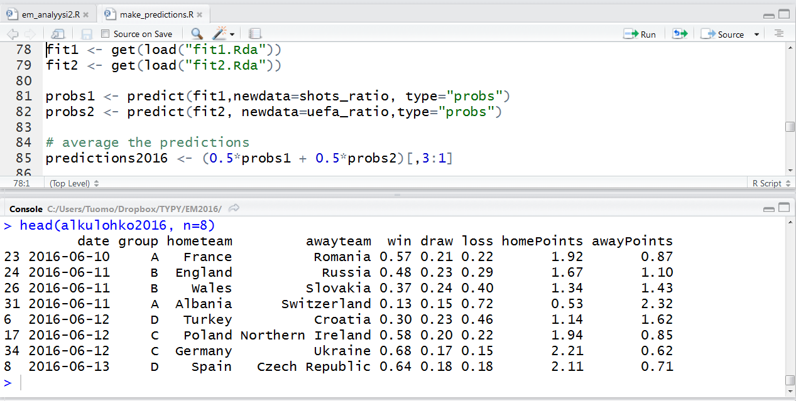
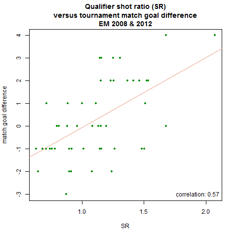
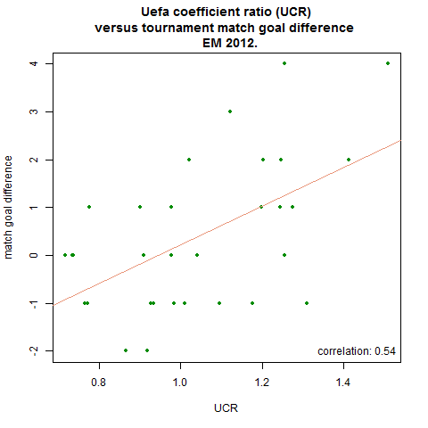

* * *

_Kuvan todennäköisyydet ottelun lopputulokselle ovat kotijoukkueen näkökulmasta._

* * *

_Kuvat, teksti ja analyysit: Tuomo Nieminen_

_Aineisto: Tuomo Nieminen, Aapeli Nevala_

 

Jalkapallon EM kilpailut alkavat tänään 10.6.. Kyseessä on hieno turnaus, jossa Euroopan parhaat jalkapallomaat ottavat mittaa toisistaan. Muut kuin isäntämaat joutuvat ansaitsemaan paikkansa kilpailuihin pelaamalla useita karsintaotteluita.

Karsintaotteluista kertyy paljon tilastoja ja edellisten lopputurnausten tulokset ovat tietenkin helposti saatavilla. Voisiko näitä tilastoja yhdistämällä ennustaa kisamenestystä tai peräti otteluiden lopputuloksia?

Kyllä voisi.

Analysoimalla vuosien 2008 ja 2012 karsinta- ja lopputurnausaineistoa, löytää useita mielenkiintoisia yhteyksiä. Merkittävin oli, että keskimääräinen karsintaotteluiden laukauksien lukumäärä korreloi voimakkaasti lopputurnauksen otteluiden maalierojen kanssa.

Erityisen kiinnostavaa on, että myös ohimenneiden laukauksien lukumäärät toteuttivat tämän yhteyden ja vieläpä voimakkaasti. Tulkinta tälle löydölle lienee, että laukauksien lukumäärä kertoo paljon joukkueen kyvystä rakentaa maalipaikkoja. Laukaustilanteeseen pääseminen on jo voitto joukkueelle.

Jalkapallo-ottelun tulos määräytyy joukkueiden keskenäisten voimasuhteiden perusteella. Tämän takia kannattaa joukkuekohtaisten tunnuslukujen sijaan tarkastella tunnuslukujen erotuksia tai suhteita tulosten selittäjinä. Vuosien 2008 ja 2012 aineistojen perusteella voimakkain lineaarinen yhteys turnauspelien maalieroihin löytyi joukkueiden hyökkäysvoimien suhteista, eli shot ratiosta (SR).

 

 

Aineistossa oli myös muita aluksi potentiaalisia tunnuslukuja, kuten esimerkiksi kulmapotkut, mutta tämä muuttuja ei kuitenkaan lopulta osoittautunut ennustusvoimaltaan riittäväksi. Kulmapotku luultavasti syntyy useimmiten puoliksi estetyn vedon seurauksena. Täten laukaukset oikeastaan selittävät jo kulmapotkut, tehden kulmapotkuista tarpeettomia selittäjiä.

Uefa tuottaa myös itse arvion joukkueiden paremmuudesta laskemalla karsintapeleihin ja edellisiin maailmanmestaruuskilpailuihin perustuvan uefa national coefficient -tunnusluvun, jonka perusteella kilpailumaat rankataan ennen turnausta.

Vuoden 2012 kisojen perusteella myös uefa coefficientin selittämisvoiman tutkiminen osoittautui hedelmälliseksi.

Tässäkin tapauksessa voimakkain lineaarinen yhteys turnausotteluiden maalieroihin löytyi coefficienttien suhteista, eli uefa coefficient ratiosta (UCR).

 

Lineraalisia selittäjiä voidaan hyödyntää rakentamalla lineaarinen malli. Tässä tapauksessa kiinnostuksen kohteena olivat otteluiden lopputulosten todennäköisyydet (voitto > tasapeli > tappio).

Todennäköisyydet ovat hyödyllisin mallinnuskohde, sillä todennäköisyyksistä voidaan ennustaa lopputulokset, tai vielä parempaa, laskea jokaisen joukkueen karsintakierroksen kokonaispisteiden odotusarvo. Tämän perusteella taas voidaan päätellä jatkoon menevät joukkueet.

Teknisiltä yksityikohdiltaan käytetty mallinnusmenetelmä oli "ordinal regression", jonka avulla tuotettiin jokaiselle ottelulle lopputulosten todennäköisyydet ja laskettin sitten joukkueiden kokonaispisteiden odotusarvo. Alla oleva taulukko näyttää nämä pistemäärät. Maat on järjestetty paremmuusjärjestykseen vasemmalta oikealle. Rivi "pisteet" kertoo odotetun pistemäärän.

 

**Lohko A** | Ranska | Sveitsi|  Romania | Albania
-- | -- | -- | -- | --
pisteet: | 6 | 5.61 | 3.84 | 1.49

**Lohko B** | Englanti | Venäjä | Slovakia|  Wales
-- | -- | -- | -- | --
pisteet: |  6.21 | 5.02 | 2.86 | 2.73

**Lohko C** | Saksa | Ukraina|  Puola | Pohjois -Irlanti
-- | -- | -- | -- | --
pisteet: |  6.92 | 3.97 | 3.94 | 2.08

**Lohko D** | Espanja | Kroatia|  Turkki | Tshekki
-- | -- | -- | -- | --
pisteet:  | 6.11 | 4.1 | 3.42 | 3.11

**Lohko E** | Belgia | Italia|  Ruotsi | Irlanti
-- | -- | -- | -- | --
pisteet:  | 6.17 | 5.28 |  3.35 | 2.06

**Lohko F** | Itävalta | Portugali|  Unkari | Islanti
-- | -- | -- | -- | --
pisteet:  | 5.76 | 5.48 | 2.9 | 2.6

 

Kuudentoista joukkoon pääsee jokaisesta lohkosta ensin kaksi parasta eli ennusteen mukaan Ranska, Sveitsi, Englanti, Venäjä, Saksa, Ukraina, Espanja, Kroatia, Belgia, Italia, Itävalta ja Portugali. Tämän lisäksi jatkoon pääsevät 4 pistemäärältään parasta joukkuetta, eli ennusteen mukaan Romania, Puola, Turkki ja Ruotsi.

Vahvin maa lohkonsa sisällä on Saksa, jonka odotettu kokonaispistemäärä on vakuuttava 6.92. Myös Englannilla,Belgialla ja Espanjalla on ennusteen mukaan yli kuuden pisteen odotusarvo. Nämä joukkueet ovat siis etukäteen varmimmat jatkoonmenijät. Malli nostaa ehkäpä hieman yllättäen Itävallan lohkon F ennakkosuosikiksi.

Jäämme jännityksellä seuraamaan kisojen tuloksia ja ennusteen tarkkuutta!

 

_Edit 10.6. klo 19:15_

_Pieni epätarkkuus todennäköisyyksissä korjattu ja todennäköisyydet ja ennusteet päivitetty. Pieni vaikutus kokonaispiste-ennustuksiin. Ei vaikutusta top16 ennusteeseen._

 

* * *

_Analyysissa käytettiin R-ohjelmistoa ja seuraavia kirjastoja: MASS, glmnetcr_
