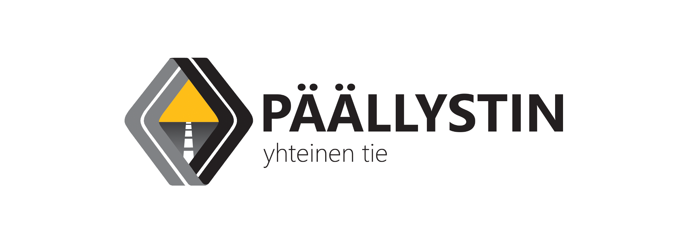

_Muuttuvassa modernissa yhteiskunnassa yliopistoelämän pitää muuttua yrityslähtöisemmäksi ja pyrkiä jatkuvasti innovoimaan uusia business-ideoita, joita voidaan välittömästi soveltaa työelämään. Tarvitaan laatua, tehokkuutta ja vaikuttavuutta parantavia uudistuksia (Grahn-Laasonen, 2016). Tyyppiarvon blogisti Harhainen estimaatti astui pöhinäkeskukseen ja innovoi nyt Moodi ry:lle kannattavaa yritystoimintaa, jonka avulla saadaan Suomi nousuun._

"Moodi ry aloittaa teiden rakentamisen ja yleisen infrastruktuurin ylläpitopalvelujen järjestämisen suunnittelut vuonna 2016.

Tähän tarkoitukseen Moodi ry perustaa liiketoimintaa varten oman yrityksen, Päällystin Oy:n.

Helsingin yliopiston Iso Pyörä-koulutusuudistuksen taustalla yksi keskeinen painopiste on koulutuksen tavoitteissa, toteutuksessa ja tutkintojen tuottamassa osaamisessa. Samalla käydään keskustelua voimassa olevista yliopiston linjauksista tutkintoihin kuuluvista opinnoista sekä niiden tuottamasta osaamisesta.

Yliopistossa on tarpeen käydä keskustelu siitä, mitä työelämäopintoja kaikkiin tutkintoihin tulee kuulua.

Asfaltinpäällystystoiminnan harjoittaminen tukee hyvin niitä taitoja, joita 2020-luvulla työelämässä tarvitaan. Päällystimen perustamisvaiheessa on huomioitu paitsi tieteenalojen viimeisin kehitys ja trendit myös työelämän muuttuvat osaamistarpeet ja vaatimukset.

Lisäksi pienet kuin isotkin pyörät pyörivät paremmin asfaltilla kuin maanteiden hiekkapinnoilla.

Päällystimen tehtävänä on toimia työelämäikkunana ja pyrkiä työllistämään mahdollisimman monta opiskelijaa. Kesään sijoittuvana kausiluontoisena työnä Päällystimelle omistautuminen on helppoa opiskelujen ohessa. Tehtäviä luvataan kaikille halukkaille.

Emme pysty maksamaan töistä rahaa, mutta työtehtävistä voidaan kirjoittaa todistus Ison Pyörän työelämäopintoihin vaadittavaa työelämäprojektia tai vanhempien tutkintovaatimuksien vaatimaa harjoittelua varten.

Päällystimen periaatteita ovat laadukas ja kestävä työjälki, opiskelijakeskeisyys sekä monipuolisuus. Yrityksen tarkoituksena on myös jatkuvasti kehittää opiskelijoiden kokonaisvaltaista osaamista sekä työelämärelevantteja taitoja."

* * *

_Harhainen Estimaatti on Tyyppiarvon jakomielinen blogisti, joka ei anna faktojen pilata hyvää kirjoitusta._
