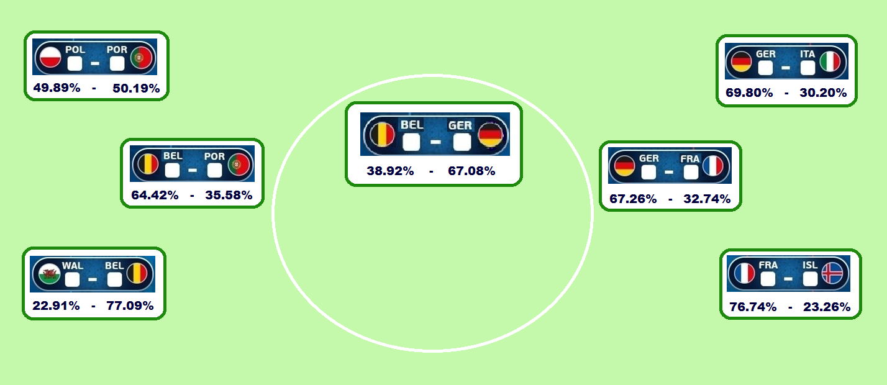

<!--  -->

teksti: **Aapeli Nevala**

analyysi: **Tuomo Nieminen**

Tyyppiarvon puolivälieriä varten päivitetty EM-ennuste povaa Islannille noin prosentin mahdollisuutta voittaa mestaruus.

Jalkapallon Euroopan mestaruuskisojen avauskierroksen todellisen yllätyksen tehnyt 340 000 asukkaan Islanti sai [Tyyppiarvon avauskierroksen ennusteessa](http://tyyppiarvo.com/2016/06/tyyppiarvo-tutki-32768-mahdollista-skenaariota-belgia-saksa-todennakoisin-em-finaali/) vain 0.17% mahdollisuuden voittaa Euroopan mestaruus. Islannin avauskierroksen vastustaja Englanti oli mallissa jopa kolmanneksi suurin mestarisuosikki.

Voitettuaan Englannin Islannin saumat kuitenkin paranivat merkittävästi: nyt Tyyppiarvon malli antaa Islannin mestaruudelle 1.01 prosentin todennäköisyyden.  Saksa voittaa nyt mestaruuden peräti yli kerran kolmesta.

joukkue	| pääsee semifinaaliin | pääsee finaaliin | voittaa
-- | -- | -- | -- |
Saksa | 69.80% | 50.18% | 34.47% |
Belgia | 77.09% | 49.83% | 24.43% |
Ranska | 76.74% | 29.80% | 15.53% |
Italia | 30.20% | 16.15% | 7.96% |
Portugali | 50.19% | 21.13% | 7.42% |
Puola | 49.81% | 20.81% | 7.26% |
Wales | 22.91% | 8.24% | 1.92% |
Islanti | 23.26% | 3.88% | 1.01% |

 

Hallitsevan mestarin Espanjan pudottaneen Italian voittotodennäköisyys on vain 8% luokkaa. Malli käyttää yhtenä selittäjänä joukkueen laukausten kokonaismäärää, jolloin Italian puolustus ei välttämättä saa ennusteessa oikeutettua arvostusta.

Mallin suosikkina jatkavat Saksa ja Belgia, jotka ovat todennäköisin finaalipari. Näistä molemmat päätyvät finaaliin noin 50% todennäköisyydellä, joten Saksa-Belgia finaali toteutuu arvion mukaan kerran neljästä.

_Laitimmaiset neljä ottelua ovat nyt tiedossa ja muut otteluparit on arvioitu todennäköisimpien voittajien mukaan. Tyyppiarvon ennusteen mukaan Saksa kohtaa finaalissa Belgian ja vie mestaruuden. Ranskaa vastaan puolivälierässä Islannilla on 23% mahdollisuus._

 

Ensimmäisellä kierroksella Tyyppiarvon ennusteen suosikeista viisi eteni jatkoon. Italia (38% mahdollisuus mallin mukaan jatkopaikkaan), Puola (45%) ja Islanti (17%) nousivat altavastaajina voittoon, joskin malli ennusti Italian ja Puolan ensimmäisen kierroksen otteluiden olevan melko lähellä kolikonheittoa.
