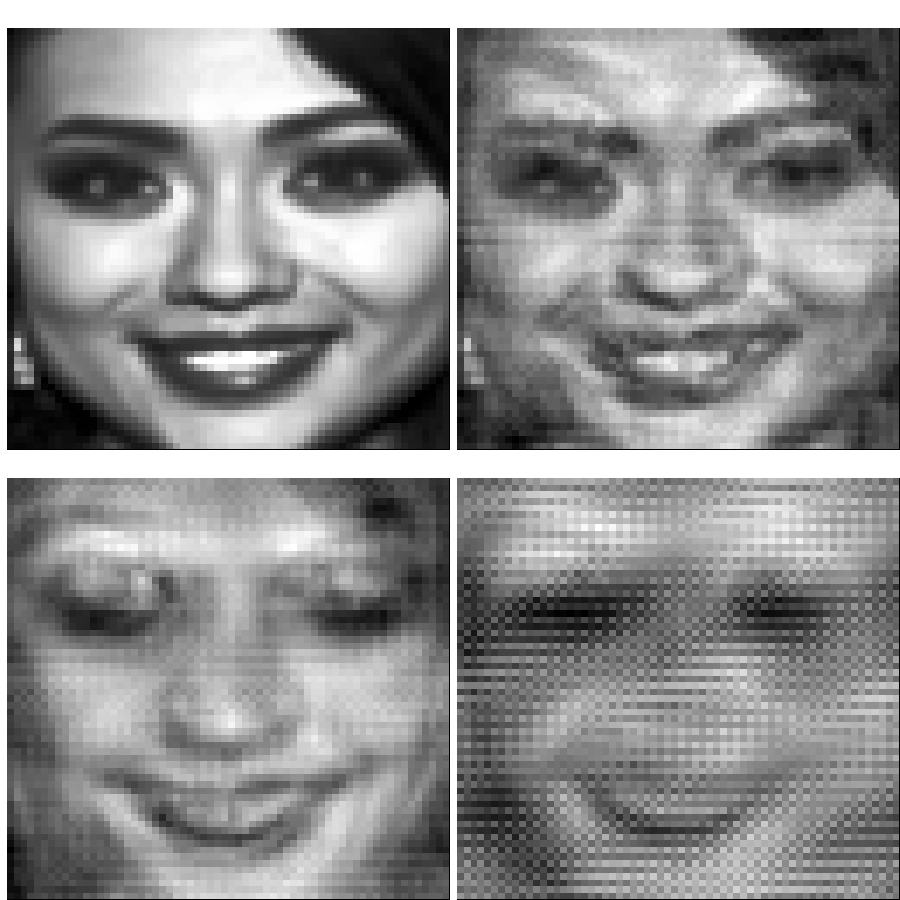

<!--\[caption id="" align="alignnone" width="7071"\] Missiehdokkaat esittelemässä juhlapukuja Rantasalmen Järvisydämellä. Kuva: Nadi Hammouda / Miss Suomi -kuvapankki.\[/caption\]-->

_Tyyppiarvo esitti keväällä 2016 avoimen haasteen, jossa tavoitteena oli ennustaa Miss Suomi kilpailun kolmen kärki ja voittaja. Haastetta varten tyyppiarvon toimitus keräsi kasaan kattavan missitietokannan, joka avattiin yleisöllä kahta viikkoa ennen vuoden 2016 kilpailun ratkeamista. Tämä artikkeli kertoo, kuinka haasteen voittanut ennuste rakentui._

Tyyppiarvon [missiennustushaaste](../2016-05-05-tyyppiarvon-suuri-missihaaste-ennusta-vuoden-2016-voittajat/) tarjosi huikean tilaisuudeen päästä soveltamaan nykyaikaisia tilastollisia menetelmiä. Tarjolla oli uniikki aineisto kauneuskilpailijoiden kasvokuvia ja menneiden kilpaluiden tuloksia.

Digitaaliset kuvat ovat yksi esimerkki kenties hieman yllättävästä numeerisen datan lähteestä. Kuvat esitetään yleensä nelikulmiona ja ne koostuvat pienistä pisteistä. Jokaisen pisteen väri voidaan yksinkertaisimmassa tapauksissa kuvata yhdellä numerolla, värikuvan tapauksessa kolmella numerolla (RGB).

Tyyppiarvon kevään 2016 missihaaste sisälsi toimituksen keräämiä tietoa edellisten ja nykyisen vuoden kilpailijoista 64x64 harmaansävykuvina. Suhteellisen heikosta laadustaan huolimatta kuvat tarjosivat todella suuren määrän numeerista informaatiota jokaisesta kilpailijasta, sillä kuvat liittivät jokaiseen kilpailijaan 64x64 = 4096 muuttujaa.

Näiden lisäksi haasteen mukana toimitettuun datasettiin kuului tietoja kilpalijoiden kriittisistä mitoista, iästä ja asuinpaikasta - kymmenisen muuttujaa lisää. Varsinainen kiinnostuksen kohde, eli kilpailijoiden sijoitukset, löytyi tietysti myös.

> Yleisimmin käytössä olevat menetelmät eivät ole suunniteltu tilanteisiin, joissa muuttujien lukumäärä on lähellä havaintojen lukumäärää, saati sitten suurempi.

**Perinteiset tilastolliset** menetelmät on lähtökohtaisesti suunniteltu tilanteisiin, joissa havaintoyksiköitä (kilpailija) on suhteellisen pieni määrä ja muuttujia vielä vähemmän. Havaintoyksiköiden määrän kasvaminen ei useimmiten aiheuta ongelmia (päinvastoin), mutta muuttujien määrän kasvaminen on yleensä ongelma.

Yleisimmin käytössä olevat menetelmät eivät ole suunniteltu tilanteisiin, joissa muuttujien lukumäärä on lähellä havaintojen lukumäärää, saati sitten suurempi. Missihaastessa havaintoja oli vain kymmeniä ja muuttujia yli neljä tuhatta. Hyvän ennustuksen tekemiseen tarvittiin luovia ja nykyaikaisia ratkaisuja.

<!--\[caption id="" align="alignnone" width="553"\] Kuvassa missikandidaattien todennäköisyyksiä päästä kolmen parhaan joukkoon.\[/caption\]-->

**Miksi muuttujien** suuri määrä sitten on ongelma ja mikä on perinteisten (tilastollisten) menetelmien heikkous?

Voisi sanoa, että se on ahneus. Käytetyimmät menetelmät on suunniteltu maksimoimaan selittämisvoima niille syötetyn havaintoaineiston suhteen. Tämä kuulostaa tietenkin lähtökohtaisesti hyvältä. Mutta silloin kun muuttujia - eli mahdollisia selittäjiä - on paljon, muodostuu ongelmaksi ylimallintaminen (overfitting).

Melkein kaikki tilastolliset ennusteet perustuvat lineaarisen mallin ajatukseen: `$y = x_1 \cdot w_1 + .. + x_k \cdot w_k$`. Selittäjiä `$x_i$` kerrotaan sopivilla painoilla `$w_i$` ja muuttujien painotetusta summasta muodostuva suora kuvaa yhteyttä selitettävän muuttujan `$y$` odotusarvoon.

Mallin etsiminen (sovittaminen) on yksinkertaisesti parhaimpien painojen `$w_i$` ratkaisemista niin, että malli tekee keskimäärin mahdollisimman pieniä virheitä, eli ennustaa lähelle todellisia havaintoja `$y$`.

Tällaisen suoran etsiminen saattaa kuulostaa yksinkertaiselta tai rajoittavalta, mutta todellisuudessa mahdollistaa vaikka mitä, sillä yleisemmässä muodossa selittäjien `$x$` tilalla voidaan käyttää mitä tahansa muunnosta `$f(x)$`, jolloin malli onkin selittäjien `$x$` suhteen vaikka kuinka kurvikas.

Tästä syystä villeimmät ja seksikkäimmätkin nykyajan tilastotieteen menetelmät, kuten vaikkapa neuroverkot, ovat loppujen lopuksi muunnelmia lineaarisesta mallista.

> villeimmät ja seksikkäimmätkin nykyajan tilastotieteen menetelmät, kuten vaikkapa neuroverkot, ovat loppujen lopuksi muunnelmia lineaarisesta mallista.

**Niin mikä ylimallintaminen?** Yksinkertaisin esimerkki ylimallintamisesta saadaan _polynomiregression_ avulla. Olkoon malli `$y = a + x^1 \cdot b_1 + x^2 \cdot b_2 ... x^d \cdot b_d$`, jossa sekä `$y$`, että `$x$` koostuvat useasta elementistä (havainnoista ja niihin liittyvistä muuttujista).

Kun `$d=1$`, eli malli on `$x$` suhteen suora, saadaan suora `$a + x^1 \cdot b_1$` kulkemaan minkä tahansa kahden `$y$` pisteen kautta valitsemalla `$a$` ja `$b_1$` sopivasti. Malli siis voidaan valita selittämään kahta havaintoa täydellisesti.

Kun `$d=2$` saadaan taas paraabeli `$a + x^1 \cdot b_1 + x^2 \cdot b_2$` kulkemaan minkä tahansa kolmen pisteen kautta valitsemalla `$a, b_1$` ja `$b_2$` sopivasti.

Vastaava pätee aina eteenpäin.

Valitsemalla riittävän monimutkainen malli, kuten esimerkiksi polynomi jonka aste on yksi vähemmän kuin havaintoja, voidaan havainnot selittää täydellisesti muuttujien `$x$` avulla. Havaintojen selittäminen täydellisesti on ennusteita tehtäessä yleensä aina huono asia, sillä oletuksena on, että havaintoihin liittyy satunnaisvaihtelua.

Ilmiötä, johon liiitty satunnaisuutta, ei lähtökohtaisesti voida täydellisesti ennustaa, joten pyrkimys luoda täydellisesti ennustava malli on tuomittu epäonnistumaan. Tästä johtuen monimutkaisempi, havaintoja yhä paremmin selittävä malli onkin jonkun rajan jälkeen huonompi, kuin yksinkertaisempi malli.

> monimutkaisempi, havaintoja yhä paremmin selittävä malli onkin jonkun rajan jälkeen huonompi, kuin yksinkertaisempi malli.

**Missikilpailussa** tavoitteena oli käyttää hyväksi vuoden 2016 kilpailijoiden kuvia ja muita tietoja ja ennustaa top3 ja voittaja. Yksi tapa lähestyä asiaa on muodostaa jokaiselle kilpailijalle todennäköisyys päästä kolmen parhaan joukkoon.

Tämän ongelman ratkaisemiseksi käytetään perinteisesti _logistista regressiota_, joka on paljon käytetty versio lineaarisesta mallista. Logistisen regression avulla voidaan tuottaa halutut todennäköisyydet kuulua yhteen kahdesta luokasta.

Edellä mainituista ongelmista johtuen menetelmää ei kuitenkaan voinut suoraan soveltaa aineistoon. Liian monen selittäjän ongelman pystyi kuitenkin missikilpailun tapauksessa ratkaisemaan neljässä vaiheessa:

1. Tiivistetään missikuvien olennainen informaatio pienempään ulottuvuuteen
2. Muodostetaan logistinen regressiomalli, mutta pakotetaan osa selittäjien painoista nollaan, poistaen selittäjät mallista.
3. Tehdään vaiheet 1-2 usealla eri tavalla ja valitaan parhaat 20%.
4. Keskiarvoistetaan parhaiden mallien tuottamat ennusteet.

**Vaihe yksi** suoritettiin tekemällä _pääkomponenttianalyysi_ (principal component analysis, PCA). Tämä on _lineaarialgebran_ menetelmä, jossa matriisi hajoitetaan osiin, jotka voidaan sitten järjestää tärkeyden mukaan ja valita tärkeimmät. Kuvassa erilaisia PCA esityksia voittaja Shirly Karvisen kuvasta.

_Kuvassa Miss Suomi 2016 Shirly Karvinen esitettynä missiaineiston pääkomponenttianalyysin kautta. Viimeisessä ruudussa alkuperäinen 64x64 kuva on esitetty vain 5 numeron avulla._

**Vaihe kaksi** suoritettiin sovittamalla logistinen regressiomalli käyttäen _l1-regularisaatioa_. Tässä menetelmässä sopivat painot `$w$` etsitään sillä lisäyksellä, että nollasta poikkeavien painojen käytöstä rangaistaan. Täten suositaan yksinkertaisempia malleja.

> Ristiinvalidointi on ehkäpä yksi tärkeimmistä menetelmistä, mitä tietojenkäsittelyn puolelta on tuotu mukaan tilastotieteen piiriin.

**Kolmannessa vaiheessa** parhaat mallit valittiin yksi-pois _ristiinvalidoinnin_ avulla (leave-one-out cross-validation). Ristiinvalidointi on ehkäpä yksi tärkeimmistä menetelmistä, mitä tietojenkäsittelyn puolelta on tuotu mukaan tilastotieteen piiriin. Ideana on arvioida mallin hyvyys sen perusteella, miten hyvin se kykenee ennustamaan tuntematonta aineistoa. Tällöin koko aineistoa ei koskaan käytetä mallin etsimiseen.

Yksi-pois -menetelmässä jätetään aina vuorolla yksi havainnoista pois ja arvioidaan, kuinka hyvin muiden havaintojen pohjalta etsitty malli ennustaa pois jätettyä havaintoa. Näin voidaan arvioida erilaisten mallien hyvyyttä hyvin konreettisesti.

**Neljättä**, eli viimeistä vaihetta sanotaan _ensemblen_ muodostamiseksi. Yleensä tämä tarkoittaa usean erilaisen mallin tulosten yhdistämistä keskiarvoistamalla mallien ennusteet. Tässä tapauksessa keskiarvoistettiin usean samankaltaisen mallin tulokset.

Lopulta näiden vaiheiden jälkeen malli ennusti kaksi top3 -kilpailijaa oikein, mitä pidän hyvänä saavutuksena. Todennäköisesti loppujen lopuksi missikilpailussa muillakin tekijöillä, kuin ulkonäöllä on merkitystä.

_Tyyppiarvon kilpailuun osallistuneiden ennusteista muodostettu ensemble [ennusti](../2016-05-13-tyyppiarvo-ennustaa-ketka-ovat-taman-illan-miss-suomi-kilpailun-karkikolmikko/) myös kaksi top3 -kilpailijaa oikein._
