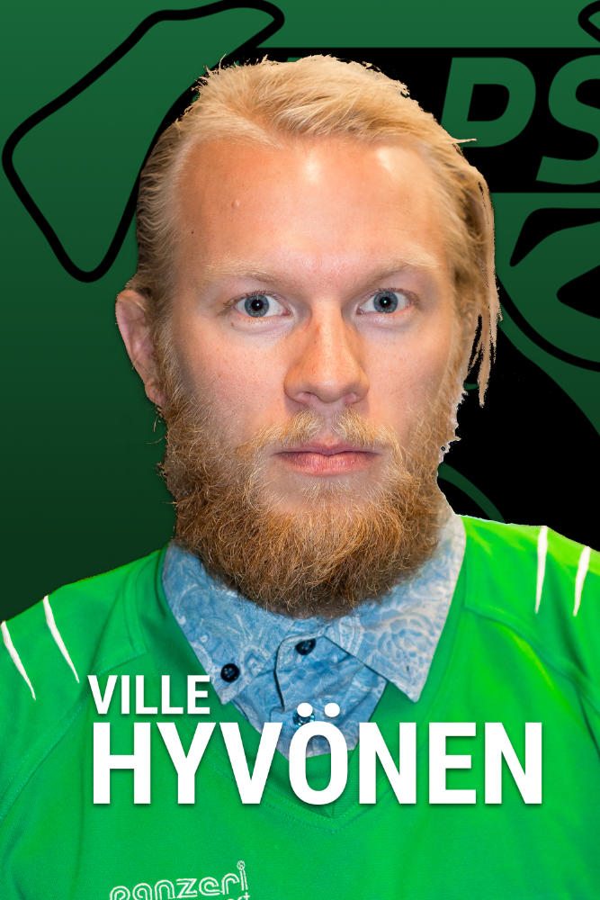
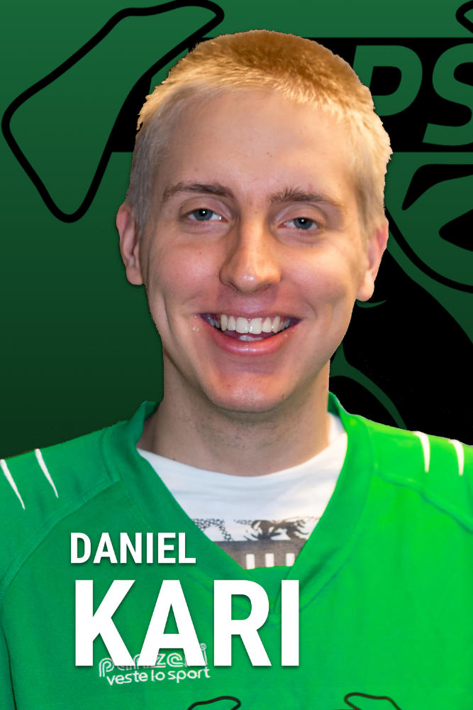
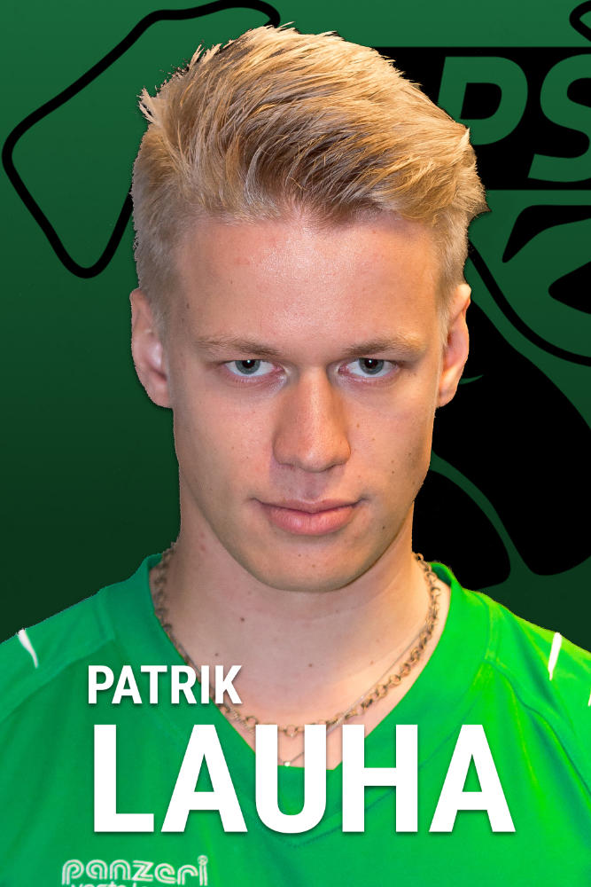
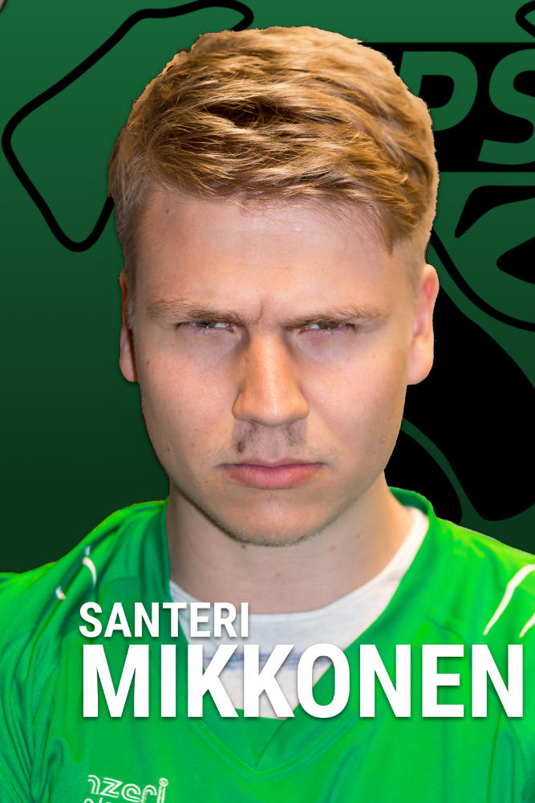
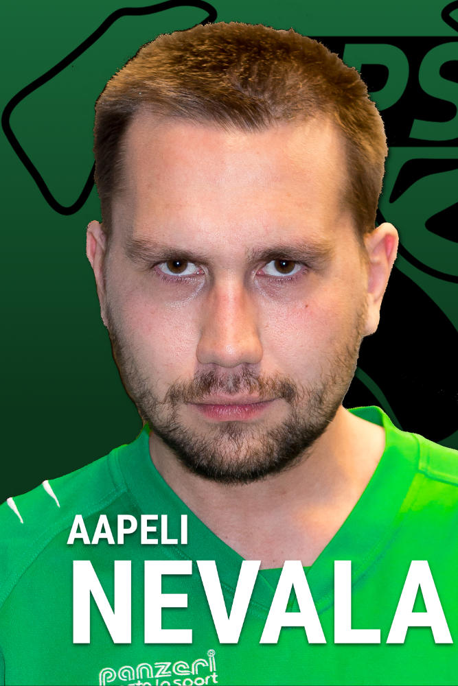
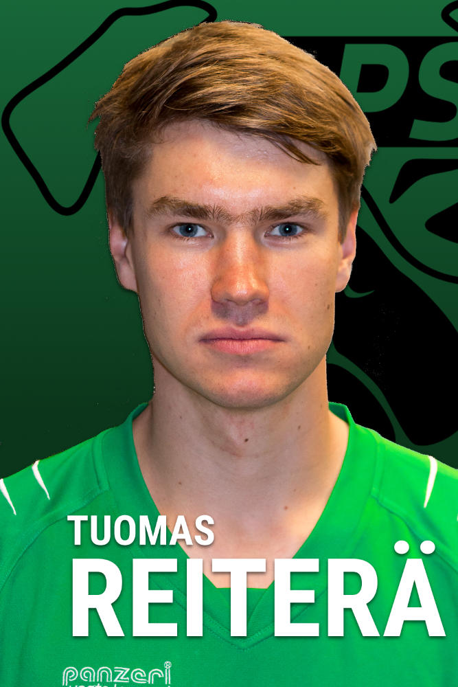
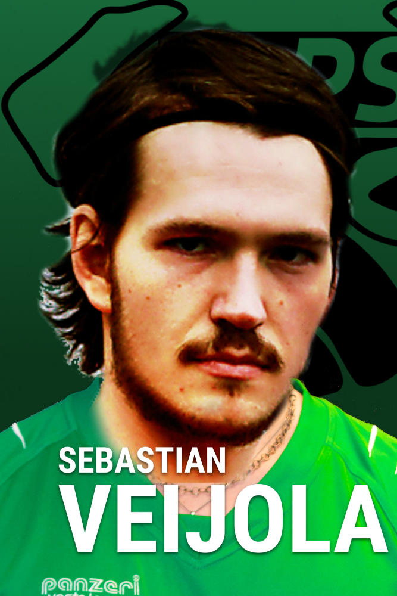
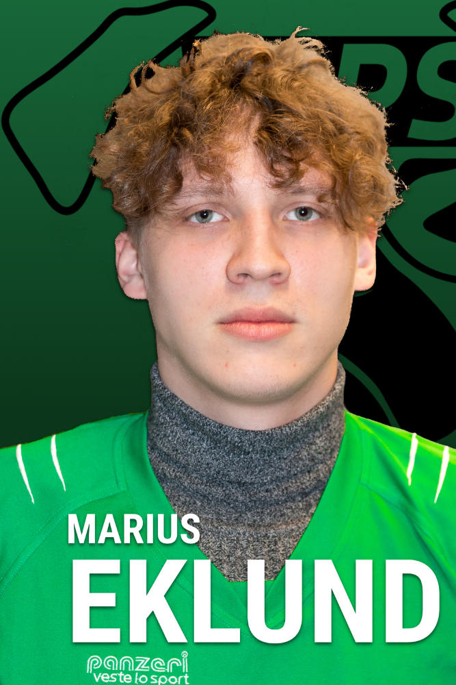
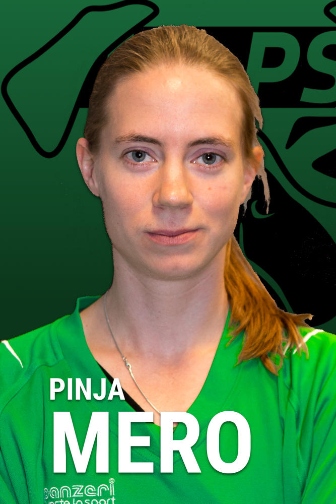

Unisportin jalkapalloliiga pyörähtää MoPSin ja VOO:n yhteisjoukkueen FC MoJon osalta käyntiin tänään, maanantaina, ottelulla FC Hammertimea vastaan. MoPSin joukkue koostuu kaudella 2016-2017 pitkälti tutuista luottopelaajista, mutta mukana on myös reilu tukku uusia fukseja, joiden otteita pelikentillä vihreäpaitojen kuvitteelliset fanit odottavat suurella mielenkiinnolla. Tyyppiarvon urheilutoimitus esittelee MoPSin tämänhetkisen sopimustilanteen mukaiset pelaajat, jotka muodostavat koiralauman ensi kauden rungon.

**Ville Hyvönen**

Lajit MoPSissa: Jalkapallo, Futsal, Lentopallo

Suurimmat saavutukset: Legendaarisen komea vapaapotkumaali yläkulmaan kevään 2016 futsalsarjan finaalissa.

Vahvuudet: Luotettava puolustuspelaaminen, pääpeli ja painava rintapotku.

Heikkoudet: Musiikkimaku, ajoittain pallollisena virhealtis.

**Daniel Kari**

Lajit MoPSissa: Sähly, (Jalkapallo, Futsal)

Suurimmat saavutukset: Kaksi maalia salibandydebyytissä syksyllä 2014. Aloitti MoPSi-uransa before it was cool.

Vahvuudet: Katso Suurimmat saavutukset.

Heikkoudet: Syksyn 2014 jälkeen ei ole maaleja näkynyt.

**Patrik Lauha**

Lajit MoPSissa: Sähly, Jalkapallo, Futsal

Suurimmat saavutukset: Kevätklassikon 2016 (KTTO:ta vastaan käytävä perinteinen salibandyottelu) ratkaisumaali jatkoajalla, MoPSi Akatemian luotsaaminen voittoon Kannunvalajien sählyturnauksessa 2016.

Vahvuudet: Johtajamentaliteetti ja halu ratkaista otteluita, likaisen nopeat kädet, liioitellun suuret luulot itsestään.

Heikkoudet: Kunto. Jalkapallokentillä ansaittu lempinimi Atomu Tanakka kertoo kaiken olennaisen.

**Santeri Mikkonen**

Lajit MoPSissa: Sähly, Jalkapallo, Futsal

Suurin saavutus: Useat salibandy-aluemestaruudet junnuvuosina.

Vahvuudet: Leveät pohkeet, terävä laukaus.

Heikkoudet: Ylipaino.

**Aapeli Nevala**

Lajit MoPSissa: Koripallo, Jalkapallo, Futsal, joskus sähly

Suurin saavutus: "Viittä maalia futsalpelissä on tietysti vaikea ylittää, mutta se oli alkulohko, joten korostaisin tässä olevani Big Time player, joka vei ratkaisevalla rankkarilla FC Jormat futsalfinaaliin viime vuonna." Hallintopuolella sai haalittua MoPSi-Basketille viisi pelaajaa jokaiseen peliin viime kauden korissarjassa.

Vahvuudet: Lähes 100-kiloinen ruho, jota on vaikea siirrellä.

Heikkoudet: Lähes 100-kiloinen ruho, jota on vaikea siirrellä.

 

**Joni Oksanen**

Lajit MoPSissa: Sähly

Suurin saavutus: Vastustajan pienikokoisen naispelaajan ajelu selästä lätkätyylisellä laitataklauksella salibandysarjan alkulohkopelissä.

Vahvuudet: Tasa-arvo.

Heikkoudet: Liian läheinen HYY:n (Helsingin Yliopiston Ylioppilasmafia) kanssa.

**Tuomas Reiterä**

Lajit MoPSissa: Sähly, Jalkapallo, Futsal, Koripallo... ”Eipä ole MoPSi sellaista lajia tainnut pelata etten olisi ollut mukana.”

Suurimmat saavutukset: Joukkueen perustaminen.

Vahvuudet: Omistautuminen, kunto ja tahtotila. Vahvistamattomien huhujen mukaan Reiterä on jo alakouluikäisenä juossut rusakon kiinni 20m takamatkalta.

Heikkoudet: Tekniikka ja tosipaikoissa sulaminen.

**Sebastian Veijola**

Lajit MoPSissa: Jalkapallo, Futsal, Sähly

Suurimmat saavutukset: MoPSin luotsaaminen Kannunvalajien sählyturnauksen voittoon 2015. Pelaa Vuosaaren futisylpeyden FC Viikinkien edustusjoukkueessa.

Vahvuudet: Fysiikka, tekniikka ja halu voittaa. Veijolan kasvot ovat todiste älykkäästä suunnittelusta.

Heikkoudet: Jerekaralahtimainen poisjääminen usean sarjan ratkaisupeleistä. Priorisoi Kannunvalajien hallitustehtävät MoPSin edelle.

**Matti Östman**

Lajit MoPSissa: Sähly

Suurimmat saavutukset: Saanut arvostetun pelaajien itsensä äänestämän MVP-maininnan toistaiseksi jokaisessa pelaamassaan ottelussa.

Vahvuudet: Peliäly, tekniikka ja fysiikka.

Heikkoudet: Rankkarit pistetään sisään...

---

Vanhojen sotaratsujen lisäksi MoPSin valmennusjohto on nostanut MoPSin junioriakatemiasta lukuisia lupaavia pelaajia kamppailemaan peliajasta edarissa. Spielführer Patrik Lauhan mukaan nuorilta on lupa odottaa paljon: ”Nämä ovat kovia ammattilaisia, jotka ovat käyneet meidän tiukat juniorimyllyt läpi. Jokaisella on kyky ratkaista pelejä ja vyöllä kovia suorituksia junnupeleistä. En näe mitään syytä, miksi akatemiasta nostetut pelaajat eivät pystyisi ottamaan paikkaansa joukkueessa ja nostamaan meidän tason vielä pykälää korkeammalle viime vuodesta.”

**Marius Eklund**

Lajit MoPSissa: Jalkapallo, Futsal

Suurimmat saavutukset: Pingiksen Suomen mestari 2003.

Vahvuudet: Likaisen liberon suurimpia vahvuuksia ovat naiset ja poolopaidat.

Heikkoudet: Rystylyönti.

**Pinja Mero**

Lajit MoPSissa: Kaikki paitsi koripallo.

Suurimmat saavutukset: Yleisurheiluseura Veikkolan Veikkojen T12 60m ja 600m ennätysten haltija 1999-2013 sekä lukuisat eriväriset mitalit monista kenttälajeista. Tilkasten juhannusfudiksen mestaruus 2013. 90-kiloisen vastustajan taklaaminen kanveesiin Tilkasen juhannusfudiksessa 2013.

Vahvuudet: Röyhkeä ja liiallisen itsevarma pelaaja, naiseksi nopea. Vastustajan häirintä onnistuu myös vaatteet päällä. \[TA:n tasa-arvotoimitus korostaa, että vahvuudet perustuvat pelaajan itsensä ilmoittamiin tietoihin, ja sanoutuu irti kaikenlaisesta syrjinnästä ja seksismistä\]

Heikkoudet: Tupakoitsijan keuhkot, oman kunnon tuntemus, pallon- ja pullonhallinta.

 

**Aku Niskanen**

Lajit MoPSissa: Jalkapallo, Futsal, Salibandy

Suurimmat saavutukset: Maalien tekeminen läpiajoista vanhoina kiekkoaikoina.

Vahvuudet: Pelisilmä ja luistelutaito.

Heikkoudet: Fyysisyyden puute ja laukaisutaito.

 

**Amanda Pitkänen**

Lajit MoPSissa: Ainakin jalkapallo ja futsal

Suurimmat saavutukset: 12v jalkapalloura espoolaisessa kasvattajaseurassa, futsalissa B SM-hopeamitali

Vahvuudet: Vahva tekninen ja taktinen lajiosaaminen, takana on myös 4 vuotta huippuvalmennusta. Monipuolinen pelaaja, jonka pelipaikka on ”kaikkipaitsimaalivahti”.

Heikkoudet: 12v jalkapalloura ESPOOLAISESSA kasvattajaseurassa. Ei ole omien sanojensa mukaan juossut vuoteen. \[Tämä ei Tyyppiarvon urheilutoimituksen fysiikkaosaston mukaan ole ongelma, sillä joukkueen avainpelaajista mm. Patrik Lauha, Aapeli Nevala ja Santeri Mikkonen eivät määritelmän\* mukaan ole juosseet vielä kertaakaan MoPSi-uransa aikana.\]

 

**Risko Rikkinen**

Lajit MoPSissa: Kaikki paitsi lentopallo

Suurimmat saavutukset: Tulossa, kunhan kentälle pääsee.

Vahvuudet: Teekkaritausta, joka takaa kattavat sisäpiiritiedot lukuisista otaniemeläisistä vastustajajoukkueista.

Heikkoudet: Teekkaritausta.

 

\* ”Juoksu määritellään tavaksi liikkua kävelyä nopeammin pikaisin askelin siten, että kaikki jalat ovat ilmassa ennen kuin seuraavaksi askeltava jalka osuu maahan.” - Wikipedia
