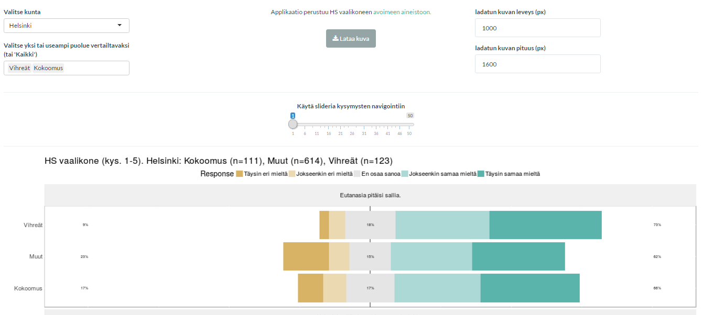
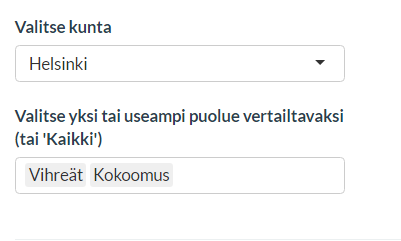

_Suomi jakautuu kuntiin, joilla on itsehallinto. Kunnan toiminnasta ja taloudesta päättää kunnanvaltuusto, joka valitaan kuntavaaleissa neljäksi vuodeksi kerrallaan. Seuraavien kuntavaalien äänestyspäivä on 9.4.2017 ja ennakkoäänestys on jo alkanut. Tyyppiarvo kehitti nyt vaalien alla HS:n vaalikonedataan perustuvan applikaation, joka mahdollistaa laajan kuntapoliittisen tarkastelun._

* * *

**90-luvun lopulla** kehitetyt vaalikoneet ovat nykyään yleinen tapa hakea vaalien alla sopivaa ehdokasta. Noin puolet suomalaisista käyttää vaalikoneita ja niitä suosivat etenkin nuoret aikuiset, joista esimerkiksi noin 70% käytti vaalikonetta vuoden 2015 eduskuntavaalien yhteydessä.

Vaalikoneissa ehdokkaat yleensä vastaavat ennen koneen julkistamista sarjaan kysymyksiä ja nämä vastaukset ovat oleellinen osa konetta. Kuntavaaleihin liittyviä koko maan kattavia vaalikoneita on ainakin [Helsingin Sanomilla](http://www.vaalikone.fi/kunta2017/) (HS) ja [YLE:llä](https://vaalikone.yle.fi/kuntavaalit2017). HS vaalikone sisältää jokaisen kunnan kohdalla 54 väitettä, joihin ehdokkaat ovat vastanneet Likert-asteikolla: 1 ("täysin eri mieltä") - 5 ("täysin samaa mieltä").

**Vaalikoneissa** ajatuksena on, että vaalikonetta tekevä kansalainen vastaa samoihin kysymyksiin kuin ehdokkaat, jonka jälkeen ehdokkaat voidaan järjestää vastausten samankaltaisuuden mukaan. Vaalikoneita käytetään yleensä enemmän oikean henkilön, kuin oikean puolueen hakemiseen. Ryhmiteltynä ehdokkaiden vastaukset kuitenkin kertovat puolueista ja niiden eroista.

HS julkaisi vaalikoneensa ytimen, eli koneeseen vastanneiden kuntavaaliehdokkaiden vastaukset, [avoimena datana](https://github.com/HS-Datadesk/avoindata/tree/master/vaalikoneet/kuntavaalit2017) tällä viikolla (27.3.207). Tyyppiarvon data-science tiimi käytti heti hyväkseen HS avointa dataa ja rakensimme "kunnat17" - applikaation, joka mahdollistaa ehdokkaiden vastausten kattavan analysoinnin kunnittain ja puolueittain.

**"kunnat17" -applikaatio** perustuu HS kuntavaalikoneen avoimeen dataan. Applikaatio löytyy allaolevasta linkistä.

[https://tuomonieminen.shinyapps.io/kunnat17/](https://tuomonieminen.shinyapps.io/kunnat17/)

_Huom. Applikaatiossa on käyttörajoitus, joka saattaa estää pääsyn tietyn kävijämäärän jälkeen. Alla linkki kopioon._

[https://arho.shinyapps.io/kunnat17-master/](https://arho.shinyapps.io/kunnat17-master/)

### Applikaation käyttö

Applikaation ideana on valita ensin kunta ja sitten mahdolliset kiinnostuksen kohteena olevat vertailtavat puolueet. Kaikkien ehdokkaiden vastauksia on mahdollista tarkastella jättämällä "Kaikki" yhdeksi valinnaksi puoluevalinnan yhteydessä. Valinnan voi poistaa näppäimillä "Backspace" tai "Delete".

Valintojen jälkeen "kunnat17" -applikaatio näyttää jokaisen HS vaalikoneen väitteen kohdalla ehdokkaiden vastausten jakaumat puolueittain kuvassa, joka esittelee 5 väitettä kerrallaan. Alla kuvakaappauksessa on Vihreiden, Kokoomuksen ja muiden ehdokkaiden vastaukset väitteeseen "Julkisia palveluita tulisi ulkoistaa ensistä enemmän yksityisten yritysten tuotettavaksi".

Kuvasta nähdään, että kyseinen väite erottaa Kokoomuksen ehdokkaat Vihreistä ja muiden puolueiden ehdokkaista. Kokoomuksen ehdokkaat suhtautuvat huomattavasti myönteisemmin esitettyyn väitteeseen.

Ryhmä "Muut" sisältää niiden ehdokkaiden vastaukset, jotka eivät kuulu Kokoomukseen tai Vihreisiin. Kuvakaappauksesta nähdään, että Helsingin Vihreistä HS koneeseen vastasi 123 henkilöä, Kokoomuksesta 111 henkilöä ja muista puolueista yhteensä 614 henkilöä.

Applikaatio tarjoaa myös mahdollisuuden ladata esitettyjä kuvia korkealaatuisina.

Tyyppiarvon toimitus toivottaa lukijoilleen hauskoja kuntapoliittisia hetkiä applikaation parissa!

* * *

Lähteet:

suomalaisten vaalikonekäyttäytyminen: http://www.stat.fi/til/sutivi/2015/sutivi\_2015\_2015-11-26\_kat\_003\_fi.html tietoja kuntavaaleista: http://www.vaalit.fi/fi/index/vaalit/kunnallisvaalit/tietoakunnallisvaaleistaerikielilla.html
