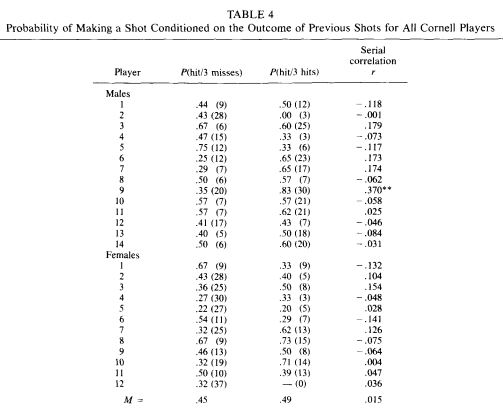

kirjoittaja on niin lineaariset mallit kuin kolmosen heitotkin hallitseva todennäköisyyspuristi, joka vaikuttaa Helsingin Yliopiston lisäksi Korisliigaan hiljattain nousseen Espoo Unitedin joukkueessa

 

.jpg)

_Kuuma käsi on Stephen Currylle tuttu ilmiö. Kuva: Wikimedia Commons_

Meillä ihmisillä on hyvät aivot. Muista eliöistä poiketen osaamme hahmottaa isoja kokonaisuuksia, ajatella kriittisesti ja pahoittaa mielemme sosiaalisessa mediassa. Toisin kuin citykanit, pystymme vierailemaan avaruudessa ja tuntemaan huonoa omatuntoa lihansyönnistä. Sen sijaan satunnaisuuden ja todennäköisyyksien todellista luonnetta olemme edelleen surkeita ymmärtämään vielä kiky-uudistuksen jälkeenkin. Luulemme näkevämme säännönmukaisuuksia täysin sattumanvaraisissa ilmiöissä ja ylipäätään aliarvioimme puhtaan sattuman merkitystä elämässä.

Kuuluisassa esimerkissä Apple joutui muuttamaan iPodiensa kappaleita satunnaisessa järjestyksessä soittavaa toimintoaan ihmisten väitettyä alkuperäistä sekoituslogiikkaa liian epäsatunnaiseksi. Palautteen mukaan sattumanvaraiseksi väitetty algoritmi saattoi välillä soittaa useita kappaleita samalta artistilta peräkkäin, jopa samalta levyltä! Oikeastihan satunnaisesti kappaleet järjestävä toiminto vaihtelisi artistia ja musiikkityyliä jatkuvasti laidasta laitaan, niinhän satunnaisuus toimii - sanottiin.

Steve Jobs laittoi insinöörinsä muuttamaan sekoituslogiikkaa, ja vihaiset palautteet loppuivat saman tien. Ihmiset saivat vihdoin kuunnella musiikkiaan sattumanvaraisessa järjestyksessä. Vitsi on tietysti siinä, että alkuperäinen sekoitusalgoritmi oli todellakin täysin sattumanvarainen, kun taas uudistettua versiota oli muokattu hieman epäsatunnaisemmaksi, jotta se vaikuttaisi sattumanvaraisemmalta.

Yksi tarinan opetuksista on, että ihmisillä on päässään valmis käsitys siitä, miltä satunnaisuus näyttää. Kuvittelemme, että kolikkoa heittäessä kruunien ja klaavojen pitäisi vuorotella melko tasaisesti - pitkä kruunaputki saa nopeasti epäilemään kolikon reiluutta. Samoin iPodista soiva viides peräkkäinen Arttu Wiskarin kappale – sen lisäksi että se on kohtalo jota harvalle soisi – pistää kyseenalaistamaan sekoitusominaisuuden toimivuuden. Yritämme siis kuvailla satunnaisuutta sääntöjen avulla, vaikka jo määritelmänsä mukaan satunnainen prosessi nimenomaan ei noudata minkäänlaisia sääntöjä.

Onnistumis- ja epäonnistumisputket ovat keskeisiä koripallossa, jossa ei ole ollenkaan harvinaista nähdä tavallisesti keskinkertaisenkin heittäjän onnistuvan useasti peräkkäin toinen toistaan vaikeamman näköisissä heitoissa. Muutama koriin mennyt heitto tuntuu nostavan seuraavien heittojen osumisprosenttia, ja vastaavasti korirautojen kolistelu ruokkii vain lisää ohiheittämistä.   Tätä ilmiötä edeltävien suoritusten vaikutuksesta seuraaviin kutsutaan lajipiireissä ”kuumaksi kädeksi” – onhan sille joku ei-sattumaan perustuva selitys oltava, miksi Golden State Warriorsin Stephen Curry heitti treeneissä [77 peräkkäistä kolmen pisteen heittoa](http://time.com/3822293/stephen-curry-warriors-77-consecutive-three-pointers/) sisään. (Jos heitot oletetaan keskenään riippumattomiksi, 85% heittoprosentilla 77 peräkkäisen onnistumisen todennäköisyys on noin yksi 300 000:sta.)

Tulisimmillaan kuumaa kättä pidetään niin vahvana voimana, että usein ottelun jälkeen hävinneen joukkueen valmentaja tarjoaa yhdeksi tappion syyksi huonojen tuomareiden ja ”ei oltu valmiita pelaamaan”-mantran lisäksi vastustajan heittäjien päästämistä ”kuumaksi”. Vaikutus ei ehkä ole täysin samaa luokkaa kuin NBA Jam-videopelissä, jossa kolmen peräkkäisen onnistumisen jälkeen pelipallo syttyy kirjaimellisesti tuleen, mutta kuitenkin niin merkittävä, että jokainen koripalloa koskaan pelannut – tämän tekstin kirjoittaja mukaan lukien – voisi puhtaasti fiilispohjalta vaikka vannoa kuuman käden olevan olemassa.

Kauempaa tarkasteltuna kuumasta kädestä höpöttäminen voi kuitenkin vaikuttaa aika kyseenalaiselta. Ehkä koripalloilijat ovat tulleet samalla tavalla satunnaisuuden hämäämäksi kuin iPodien käyttäjät ja luulevat onnistumisputkien olevan vastaansanomaton todiste edellisten heittojen vaikutuksesta seuraaviin. Kyseessä saattaa mahdollisesti olla myös mehukas esimerkki nk. vahvistusharhasta (”confirmation bias”), sillä pitkät onnistumisputket ovat mieleenpainuvia ja helposti huomattavia toisin kuin tilanteet, jossa muutamaa peräkkäistä koria seurasikin epäonnistuminen.

Edellisen kaltaiset epäilykset jakoivat psykologit Amos Tversky ja Thomas Gilovich sekä tilastotieteilijä Robert Vallone (jatkossa GVT), jotka vuoden 1985 klassikkotutkimuksessaan [”_The Hot Hand in Basketball: On the Misperception of Random Sequences_”](http://www.sciencedirect.com/science/article/pii/0010028585900106) yrittivät löytää tieteellistä näyttöä kuuman käden olemassaololle. Ongelmaa lähestyttiin tutkimalla edellisen heiton vaikutusta seuraavaan – mikäli kuuma käsi olisi olemassa, täytyisi heittojen, joita edelsi kori, mennä koriin paremmalla prosentilla kuin tavallisesti.

Tutkimuksessa tutkittiin aluksi heittoja 80-luvun NBA-otteluista – eikä löydetty tilastollista näyttöä mistään salaperäisistä supervoimista. Onnistumisputkia seuraavat heitot onnistuivat samanlaisella todennäköisyydellä kuin kaikki heitot ylipäätään. Koska pelaajien uskosta kuumaan käteen kumpuava irrationaalinen itseluottamus, mikä usein johtaa vaikeampiin heittoyrityksiin, voi monimutkaistaa oikeista peleistä kerätyn aineiston tulkintaa, tehtiin sama koe vapaaheitoille ja harjoitusheitoille – ei vieläkään näyttöä. Itseasiassa tutkijat löysivät enemmän todisteita sille, että joissain tilanteissa edeltävä onnistuminen _laskee_ seuraavan todennäköisyyttä, mutta yleisesti vaikutus kumpaankaan suuntaan oli kaikissa kokeissa sen verran pieni, että luotettavin johtopäätös oli yksinkertaisesti todeta peräkkäisten heittojen olevan keskenään riippumattomia. Ihan kuin (sopivasti painotettua) kolikkoa heittäisi.

 

 

_GVT:n alkuperäisessä tutkimuksessa ei löydetty merkittävää eroa edes onnistumisputken ja hutiputken jälkeisten heittojen onnistumisprosenteista, onnistumisputken ja keskiarvon erosta puhumattakaan_

Siitäkin huolimatta, että kuuman käden epäselvä olemassaolo koripallossa ei välttämättä kuulu ihmiskunnan suurimpien ratkaisemattomien ongelmien joukkoon, tutkimustulos oli merkittävä tiedepiireissä. Jos ilmiö pystytään todistamaan harhaksi koripallossa, jossa _ihan joka ikinen_ luulee sen olevan olemassa, on se luultavasti harhaa myös monella muulla alalla. [Google Scholar](https://scholar.google.fi/scholar?q=The+Hot+Hand+in+Basketball:+On+the+Misperception+of+Random+Sequences&hl=fi&as_sdt=0&as_vis=1&oi=scholart&sa=X&ved=0ahUKEwiLrrft6fnVAhVJCZoKHSh4BMAQgQMILTAA)\-palvelussa GVT:n paperiin on viitattu muissa tieteellisissä artikkeleissa 1393 kertaa, ja kuuma käsi-uskomuksen esiintymistä esimerkiksi osake- ja investointimarkkinoilla on sittemmin tutkittu tarkasti. Itse Nobel-palkittu psykologi-taloustieteilijä Daniel Kahneman toteaa hittikirjassaan ”[Ajattelu, nopeasti ja hitaasti](https://books.google.fi/books/about/Thinking_Fast_and_Slow.html?id=ZuKTvERuPG8C&redir_esc=y)” että ”kuuma käsi on vain massiivinen, laajalle levinnyt kognitiivinen illuusio”, viitaten juuri koripalloon todisteena.

Sen sijaan korispiireissä tutkimustulos ei muuttanut mitään, vaan kuuma käsi oli edelleen yksikäsitteisesti olemassa. Kun Boston Celticsin yhdeksän kertaa NBA-mestaruuteen valmentaneelta Red Auerbachilta kysyttiin kommentteja GVT:n löydökseen, vastaus oli [”Who is this guy? So he makes a study. I couldn't care less.”](https://books.google.fi/books?id=fPoZBwAAQBAJ&pg=PA35&dq=red+auerbach+So+he+makes+a+study+I+couldn%27t+care+less&hl=fi&sa=X&ved=0ahUKEwjtvLP16vnVAhVJDZoKHQvyCV4Q6AEIIzAA#v=onepage&q=red%20auerbach%20So%20he%20makes%20a%20study%20I%20couldn%27t%20care%20less&f=false) Pukukopissa hienovaraisellakin keskustelunaloituksella ”oletteko muuten lukeneet tutkimuksesta, jonka mukaan korisheitot olisivatkin vain sarja samoin jakautuneita toisistaan riippumattomia bernoulli-kokeita?” tulee nopeasti leimatuksi laskinta toisessa ja MAOL:ia toisessa kädessä joka paikkaan kantavaksi matikkahörhöksi. Toisin sanoen juuri sellaiseksi sosiaalisesti kömpelöksi light-kokiksella hampaansa syövyttäväksi hupparinörttiksi, jotka ovat joukkona tehneet urheilustakin tiedettä ja matikkaa yrittämällä tunkea erilaisia siruja milloin mihinkin pelivälineeseen ja ruumiinosaan. Siis lajilegenda Charles Barkley sanoin, ”[a bunch of guys who never played the game, and never got the girls in high school](https://www.cnet.com/news/charles-barkley-nerds-never-played-the-game-never-got-the-girls-in-high-school/)”. No, kirjoittajan kohdalla tuosta on toinen puoli tottakin.

Tverskyn, Gilovichin ja Vallonen tutkimus sai elää rauhassa 30 vuotta tiedeyhteisön tunnustamana ja urheilupiirien sivuuttamana, kunnes vuonna 2015 urheilijat saivat tukea sieltä mistä viimeiseksi odottivat – matikkahörhöiltä. [Joshua B. Miller ja Andrew Sanjurjo](http://www.econ.pitt.edu/sites/default/files/Miller.%20Gambler%27s%20hot%20hand..pdf) löysivät alkuperäisestä tutkimuksesta virheen, joka ei liittynyt tutkimusmenetelmiin tai koejärjestelyihin tai muuhun pilkunviilaukseen, vaan tulosten tulkinnassa käytettyyn todennäköisyyslaskentaan. Julkaisua puitiin välittömästi [New York Timesissa](https://www.nytimes.com/2015/10/18/sunday-review/gamblers-scientists-and-the-mysterious-hot-hand.html?mcubz=0) ja [Wall Street Journalissa](https://www.wsj.com/articles/the-hot-hand-debate-gets-flipped-on-its-head-1443465711), ja se oli muutaman viikon ajan maailman ladatuin tieteellinen julkaisu. Millerin ja Sanjurjon väittämä laskuvirhe alkuperäisessä tutkimuksessa on erittäin epäintuitiviinen, lähestulkoon hullulta kuulostava, mutta sitäkin kiinnostavampi.

Ongelman ytimeen porautuva kysymys kuuluu seuraavasti:

_Heitetään tavallista kolikkoa 100 kertaa. Jokaista (vähintään) kolmen heiton kruunaputkea seuraavan heiton tulos kirjoitetaan lapulle ja laitetaan laatikkoon. Toistetaan operaatio n kertaa, jolloin saadaan n laatikkoa. Nostetaan nyt sattumanvaraisesti yhdestä laatikosta yksi lappu, millä todennäköisyydellä se on kruuna?_

Ilmiselvä vastaus on tietysti 50%, eiväthän heitot riipu millään tavalla toisistaan. Paitsi että oikea luku onkin 46%, ja kaikki mitä ikinä luulit ymmärtäneesi todennäköisyyslaskennasta onkin nyt päälaellaan.  Tämä kääntää ympäri myös GVT:n alkuperäisen tutkimuksen, joka perustui oletukseen, että ylläolevan pulman vastaus olisi ollut 50%. Jos reilulla kolikolla – jolla ei tietysti ole kylmää tai kuumaa kättä – onnistumisprosentti putoaa onnistumisputken jälkeen, _samana pysyvä onnistumisprosentti onkin kuuman käden ilmentymä_.

Miller ja Sanjurjo analysoivat GVT:n alkuperäisen aineiston uudelleen huomioiden yllämainitun ”sisäänrakennetun kylmän käden” ja löysivät selvää tukea kuuman käden olemassaololle. Kolmen peräkkäisen onnistumisen jälkeen pelaajien heittoprosentti oli seuraavalla heitolla keskimäärin 8 prosenttiyksikköä korkeampi, mikä voi kuulostaa pieneltä, mutta ei sitä ole. Viime kaudella NBA:n parhaan kolmen pisteen heittäjän ja koko liigan keskiarvon heittoprosenttien ero oli noin 9 prosenttiyksikköä.

Jos ylläoleva kuulostaa täysin järjenvastaiselta, et ole yksin. Gilovich kiistää uusien löytöjen merkittävyyden edelleen, ja erinäisissä akateemisissa blogeissa teemasta on väitelty raivokkaasti. Harha on kuitenkin todellinen, ja sen syyt – kuten myös menetelmä voittaa ruletissa useammin kuin hävitä – esitellään tarkemmin seuraavassa osassa.

Lopuksi on kuitenkin syytä yrittää tulkita tulosta lajin kannalta, sen tiedostaen, että post hoc dataan sovitetut hyvältä kuulostavat teoriat ovat usein aika merkityksettömiä ilman tarkempaa syyniä. Jos uskotaan, että muutama onnistunut heitto tekee seuraavankin onnistumisesta todennäköisempää, oliko NBA Jam sittenkin puoliksi todellinen ja pitäisikö joukkueiden määrätietoisemmin yrittää saadaa jokin pelaajansa onnistumisputkeen ja ratsastaa sillä? Teoriassa ehkä, mutta uskottavampi selitys lienee, että urheilijalla on olemassa objektiivisesti hyviä (helppo vastustaja, onnistunut valmistautuminen) ja huonoja (sairastelu, krapula) päiviä, joista hyvänä päivänä heitot menevät sisään paremmin kuin keskimäärin - jolloin myös onnistumisputkia syntyy enemmän kuin mitä keskivertopäivän onnistumisprosentilla "pitäisi" - ja huonona vastaavasti huonommin. Jos allekirjoittanut heittäisi ensin vahvassa humalassa 1/10 vapaaheittoviivalta ja parin päivän palauttelun jälkeen 8/10, olisi teoreettinen mahdollinen tulkinta, että ensimmäisessä otoksessa jouduin vain pahaan ohiheittoputkeen, josta ulospääseminen oli mahdotonta, kun taas jälkimmäisessä sain kuuman käden ja kori näytti valtameren kokoiselta.

Yllä syy ja seuraus ovat kuitenkin lipsahtaneet väärin päin ja paras päätelmä lieneekin, että vaikka onnistumisten tuomaa itseluottamusboostia ei tule missään nimessä väheksyä, lopulta onnistumisputket itsessään eivät kuitenkaan ole syy uusille uusille onnistumisille, vaan monen tekijän yhteisvaikutuksesta syntyvät "hyvät päivät" johtavat onnistumisten sarjoihin.

_Kiinnostuitko aiheesta? Osa II: "Kuinka voittaa ruletissa, eli miksi kaikki mitä luulit tietäneesi todennäköisyyslaskennasta onkin valetta" julkaistaan lähitulevaisuudessa._

* * *

_EDIT: Juttua muokattu 30.8. 11:25. Täsmennetty kolikonheittokysymyksen asettelua._
