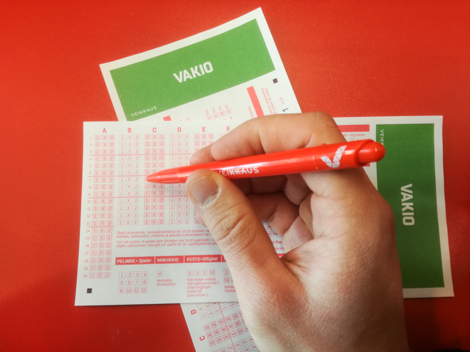
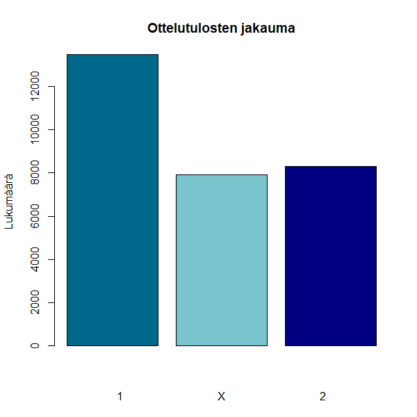

_Vakioveikkausta on pelattu Suomessa jo vuodesta 1940 alkaen._

Tyyppiarvon toimitus sai taannoin haltuunsa arvokasta dataa, kun innokas harrastaja oli kerännyt talteen Vakioveikkauksen oikeat voittorivit lähes 45 vuoden ajalta! Kiireisen journalistintyön ja sivutoimisen opiskelun keskellä aineisto ehti jo hetkeksi hautautua Tyyppiarvon datadeskin pöytälaatikkoon, mutta nyt TA tuo vihdoin veikkaustulokset päivänvaloon.

Vakioveikkaus eli Vakio on urheiluvedonlyönnin muoto, jossa veikataan tyypillisesti jalkapallo-otteluiden lopputuloksia. Yksi vakiorivi koostuu kolmestatoista kohteesta eli ottelusta, joista kullakin on kolme mahdollista arvoa: 1, X ja 2. Näistä 1 tarkoittaa kotivoittoa, 2 vierasvoittoa ja X tasapeliä varsinaisen peliajan jälkeen.

Kuten kaikki urheilua seuraavat tietävät, ovat kotivoitot jalkapallossa selvästi vierasvoittoja yleisempiä, mikä johtuu esimerkiksi yleisön kannustuksen tuomasta edusta ja tuomareihin kohdistuvasta paineesta. Luonnollinen alkuaskel oli siis selvittää, kuinka yleisiä kotivoitot oikeastaan ovat suhteessa vierasvoittoihin.

Analysoitava aineisto ulottuu vuoden 1972 syyskuusta vuoden 2016 lokakuuhun, ja kattaa kokonaisuudessaan 2&nbsp;285 viikon Vakiotulokset. Koska jokainen kierros koostuu 13 kohteesta, sisältää data siis huimien 29&nbsp;692 ottelun tulokset.  Näistä kotivoittoihin on päättynyt 13&nbsp;464 peliä, kun taas vierasvoittojen lukumäärä on 8310. Kotivoitot ovat siis jopa 60% vierasvoittoja todennäköisempiä. Tasapelejä on 7918 eli lähes yhtä paljon kuin vierasvoittoja.

## Yleisin vakiorivi

Aineistosta löytyy myös yksi erityisen kiinnostava löydös: vakiorivi, joka on esiintynyt aikavälillä peräti kolme kertaa! Tapahtumaa voi pitää jokseenkin yllättävänä, sillä mahdollisia rivejä on olemassa 3^13 = 1&nbsp;594&nbsp;323 kappaletta. Mutta kuinka harvinaisesta tapahtumasta oikeastaan onkaan kysymys?

Todennäköisyyttä sille, että joku rivi esiintyy aineistossa vähintään 3 kertaa voidaan arvioida yksinkertaisen simulaation avulla. Aineiston perusteella todennäköisyys yksittäiselle kotivoitolle on noin 0.45, tasapelille 0.27 ja vierasvoitolle 0.28. Vajaan 45 vuoden vakioveikkausrivit voidaan nyt generoida arpomalla 2285 kappaletta 13 merkin mittaisia merkkijonoja, joissa merkkien 1, 2 ja X esiintymistodennäköisyydet vastaavat edellä mainittuja koti- ja vierasvoiton sekä tasapelin todennäköisyyksiä.

Kun simulaatio toistetaan tarpeeksi monta (esim. 10 000) kertaa, voidaan arvioida todennäköisyyttä saman vakiorivin esiintymiselle vähintään kolme kertaa sen perusteella, kuinka monessa 2285 rivin aineistossa jokin rivi esiintyy yli kaksi kertaa. Tämänkaltainen simulaatio vaatii jonkin verran laskentakapasiteettia ja aikaa, joten Tyyppiarvon urheiluvedonlyöntitoimitus suoritti laskennan valmiiksi. Kolme kertaa esiintyvän vakiorivin todennäköisyydeksi saatiin vaivainen 0.008, eli vajaa prosentti.

Kotikatsomoiden innokkaimmat nikijuuselat voivat siis jo syystäkin hehkuttaa suomalaisen urheiluvedonlyönnin pientä ihmettä. On kuitenkin syytä muistuttaa, että suurista aineistoista on jokseenkin helppoa löytää yksittäisiä ilmiöitä, joiden todennäköisyys on hyvinkin pieni. Suuresta salaliitosta ei siis suinkaan ole kysymys - ainakaan välttämättä.

Lopuksi tarjottakoon pieni herkkupala veikkaamisesta innostuneille lukijoille. Kyse on tietenkin kolmen kerran "ihmerivistä":

> **1-2-X-1-1-1-X-1-1-1-1-X-2**

Tyyppiarvo muistuttaa, että kaikki vedonlyöntikokeilut ihmerivillä tapahtuvat lukijoiden omalla vastuulla. Eri viikkojen Vakiorivit ovat luonnollisesti toisistaan riippumattomia, eikä menneiden rivien avulla valitettavasi voi päätellä käytännössä mitään tulevista riveistä, ainakaan ilman tietoa menneiden Vakiokierrosten otteluista. Kärsivällisimmät veikkaajat voivat myös kotona simuloida todennäköisyyttä saman Vakiorivin esiintymiselle 4 kertaa tiettynä ajanjaksona muokkaamalla hieman Tuomo Niemisen esimerkkikoodeja:

[GitHub - Tuomo Nieminen](https://github.com/TuomoNieminen/vakio)

Tyyppiarvon toimitus kiittää Keijo Lehtimäkeä vakioveikkausdatan keräämisestä!
