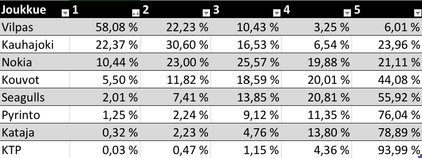

Miesten Korisliigan runkosarja on päättynyt, ja kuten aina runkosarjan loputtua, osa pelaajista ja joukkueista jatkaa pudotuspeleihin, kun taas osan kohtaloksi jää Bayes-ennustemallien rakentelu kotona. Pudotuspelit alkavat tänään sunnuntaina, ja mestari on selvillä joskus toukokuun puolenvälin jälkeen. Tyyppiarvon urheilutoimitus odottaa kuitenkin playoffeja niin kärsimättömänä, että päätimme rakentaa tilastollisen mallin koripallo-otteluiden lopputulosten ennustamiseen jo etukäteen.

Mallissa koripallo-ottelun lopputulos, tai tarkemmin sanottuna joukkueiden pisteiden erotus (_+x_ pistettä jos kotijoukkue voittaa, _\-x_ jos vierasjoukkue voittaa), oletetaan normaalijakautuneeksi keskiarvolla (_kotijoukkueen\_taso_ - _vierasjoukkueen\_taso_ + _kotietu_) ja jollain skaalaparametrilla σ. Oleelliset parametrit mallissa ovat joukkueiden voimasuhteita kuvaavat tasoparametrit, joita päivitetään jokaiselle joukkueelle sitä mukaa, kun uusia otteluita pelataan. Joukkueiden tason oletetaan vaihtelevan viikosta toiseen päivän kunnon, loukkaantumisten ja pelaajavaihtojen myötä. Koko homma muodostetaan [hierarkiseksi Bayes-malliksi](https://en.wikipedia.org/wiki/Bayesian_hierarchical_modeling), jonka posteriorijakaumaa tutkimalla saadaan arviot halutuille parametreille. Mallin tarkempi kuvaus, data ja koodi löytyvät [GitHubista](https://github.com/tobbaijas/korisliigamalli).

Kun tasoparametrit on estimoitu, voidaan niiden perusteella yrittää ennustaa tulevien otteluiden lopputuloksien odotusarvoa, ja siten normaalijakaumaoletuksella myös voittotodennäköisyyksiä. Kun toimituksessa testattiin mallin toimivuutta antaen sille harjoitusdataksi esimerkiksi kauden 50 ensimmäistä ottelua, joiden pohjalta yritettiin ennustaa seuraavan 10 ottelun voittajat, osui valinta oikeaan noin 72% ajasta. Tästä rohkaistuneena Tyyppiarvo päätti simuloida läpi koko Korisliigan pudotuspelikaavion 10000 kertaa seuraavin tuloksin:

_Korisliigajoukkueiden todennäköisyydet päätyä sijoille 1-8._

Kuten Vilppaan mestaruustodennäköisyydestä näkee, ennusteella tuppaa olemaan taipumusta liialliseen varmuuteen veikkauksissaan. Syynä tähän on ennen kaikkea se, ettei malli ymmärrä, että esimerkiksi äkilliset loukkaantumiset (joita ei voida ennustaa datasta) voivat muuttaa joukkueiden voimasuhteita dramaattisesti. Jos Vilpas pelaisi koko pudotuspelit varmasti samalla kokoonpanolla kuin runkosarjassa, 99% mestaruusoddsit voisivat olla edes hieman paremmin perustellut. Oletus ei kuitenkaan vastaa tosielämän tilannetta, jossa loukkaantumisia voi tapahtua koska vaan. Vilppaan kenties tärkein pelaaja Teemu Rannikko nimittäin loukkasi "alaraajansa" runkosarjan viimeisessä ottelussa, eikä sen vuoksi pelaa pudotuspeleissä.

Joukkueen tasoa ilman ykköspelintekijäänsä on mahdotonta arvioida tarkasti, mutta jonkinlainen approksimaatio voidaan tehdä tutkimalla niitä Vilppaan runkosarjaotteluita, joissa Rannikko ei pelannut (9 kpl). Kun malli sovitetaan dataan jossa huomioidaan vain ilman Rannikkoa pelatut ottelut, vaikuttaa Vilpas edelleen sarjan vahvimmalta joukkueelta, mutta ei läheskään niin murskaavasti. Joukkueen tason indikaattori putosi 20:n yläpuolelta 5,95:een.

Nyt myös pudotuspelikaavio voidaan simuloida uudelleen Rannikon loukkaantuminen huomioonottaen.

_Korjatut todennäköisyydet._

Taulukosta voi nopealla laskutoimituksella laskea myös ennusteen antamat todennäköisyydet puolivälieräparien voittajille:

- **Vilpas** - KTP 94 - 6
- **Kauhajoki** - Pyrintö 76 - 24
- **Nokia** - Kataja 79 - 21
- Seagulls - **Kouvot** 45 - 55

Tyyppiarvo luottaa malliinsa sataprosenttisesti, minkä vuoksi tulemme seuraamaan mallin toimivuutta läpi pudotuspelien asettamalla mallin ennustuksen mukaisen 10€ vedon Veikkauksen asettamien tasoitusten mukaan jokaiseen otteluun. Alkukassana toimii Moodi ry:n koko varallisuus, jonka summa on juttua kirjoitettaessa päätähuimaavat 100 euroa. Esim. tämän jutun julkaisupäivänä 8.4. Vilpas-KTP ottelussa Vilpas on Veikkauksen mukaan 17,5 pisteen suosikki, mutta ennustemalli pitää (ilman Teemu Rannikkoa pelaavaa) Vilpasta vain noin 14 pisteen suosikkina, joten pelaamme siis KTP:ta. Tasoitusten kanssa Veikkauksen kertoimet molemmille joukkueille ovat tyypillisesti 1,85. Alla Tyyppiarvon vedonlyöntiseuranta, joka päivittyy pudotuspelien etenemisen myötä. Taulukon sarake "Luotto-%" on mallin antama todennäköisyysarvio sille, että veto voittaa. Toisin sanoen KTP:n todennäköisyys hävitä alle 17,5 pistettä on 61%. Veikkauksen konservativiinen kerroin 1,85 tarkoittaa, että teoriassa vedon voiton todennäköisyyden pitää olla vähintään n. 55% (0.55 \* 1.85 > 1), jotta veto edes odotusarvoisesti olisi voitollinen.

* * *

VEDONLYÖNTISEURANTA:

**ALKUKASSA: 100 €**

| PVM |  Ottelu | Mallin ennuste | Luotto-% |Tulos |
|--|--|--|--|--|
| 8.4. | Vilpas -  **KTP + 17,5** | Vilpas 13,7 | 61 % | 83-87 |
| 8.4. | **BC Nokia -3,5** - Kataja | Nokia 7,7 | 62 % | 95-78 |
| 8.4. | Kauhajoki - **Pyrintö +8,5** | Kauhajoki 7,8 | 52 % | 84-74 |
| 9.4. | Seagulls - **Kouvot +7,5** | Seagulls 1,1 | 68 % | 88-90 |
| 10.4. | **KTP +6,5 -** Vilpas | Vilpas 0,8 | 65 % | 64-95 |
| 10.4. | **Pyrintö +0** - Kauhajoki | Pyrintö 0,5 | 51 % | 88-100 |
| 10.4. | Kataja - **Nokia + 3,5** | Nokia 1,4 | 64 % | 82-103 |
| 11.4. | **Kouvot -2,5** - Seagulls | Kouvot 7.0 | 64 % | 72-76 |
| 12.4. | Vilpas - **KTP + 18,5** | Vilpas 17,6 | 51 % | 77-69 |
| 12.4. | **BC Nokia -8,5** - Kataja | Nokia 14,5 | 67 % |92-80  |
| 12.4. | **Kauhajoki -10,5** - Pyrintö | Kauhajoki 11,3 | 52 % | 108-75 |
| 13.4. | Seagulls - **Kouvot +9,5** | Seagulls 4.7 | 61 % | 82-73 |
| 14.4. | **KTP + 8,5** \- Vilpas | Vilpas 6,1 | 57% | 55-88 |
| 15.4. | **Kouvot +2,5** \- Seagulls | Kouvot 3,7 | 67% | 74-83 |
| 19.4. | **Vilpas -8,5 -** Seagulls | Vilpas 13,8 | 65% | 78-71 |
| 20.4. | **Kauhajoki -4,5** - BC Nokia | Kauhajoki 7,5 | 59% |92-78  |
| 21.4. | Seagulls **- Vilpas -3,5** | Vilpas 3,8 | 51% | 77-86 |
| 22.4. | BC Nokia **- Kauhajoki +3,5** | Nokia 0,2 | 61% | 89-84 |
| 24.4. | **Vilpas -10,5** **-** Seagulls | Vilpas 11,2 | 52% | 79-71 |
| 25.4. | **Kauhajoki -5,5 -** BC Nokia | Kauhajoki 7,6 | 55% | 78-72 |
| 26.4. | **Seagulls +6,5 -** Vilpas | Vilpas 2,9 | 61% | 69-86 |
| 27.4. | BC Nokia - **Kauhajoki +4,5** | Nokia 1,4 |  59% | 102-105 |
| 29.4. | **Kauhajoki -5,5 -** BC Nokia | Kauhajoki 7,8 |  59% | 84-82 |
| 6.5. | Vilpas **- Kauhajoki +8,5** | Vilpas 8,4 |  50% | 86-75 |
| 9.5. | Kauhajoki **- Vilpas +0** | Vilpas 1,1 |  51% | 85-79 |
| 14.5. | **Kauhajoki - 1,5** **-** Vilpas | Kauhajoki 3,3 |  53% | 93-75 |

**Kassa 14.5.: 84€** 

PS. Todellisuudessa asetetut vedot ovat hypoteettisia, eikä Tyyppiarvo suosittele urheiluvedonlyöntiä rahantekomielessä, varsinkaan jossain määrin mielivaltaisiin matemaattisiin arvioihin perustuen.

Lopulta malli ei onnistumaan toimimaan voitollisesti Veikkauksen kertoimia vastaan, mutta huomionarvoisesti tuotti usein lähes identtisiä arvioita kuin Veikkauksen mallit. Ottelun voittajan malli ennusti oikein 73% tarkkuudella.

* * *

Kirjoittaja on päätoiminen Tyyppiarvon urheilutoimittaja ja sivutoiminen Korisliigapelaaja, jonka kohtaloksi jäi tänä keväänä Bayes-ennustemallien rakentelu kotona.
