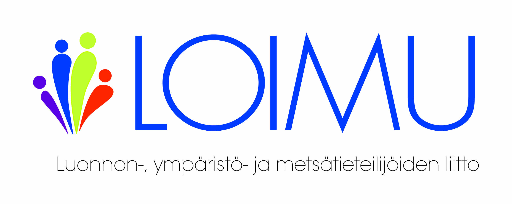

**TERVETULOA LUONNON-, YMPÄRISTÖ- JA METSÄTIETEILIJÖIDEN ASIANTUNTIJAYHTEISÖÖN!**

* * *

Onnittelut opiskelupaikastasi ja tervetuloa opiskelijajäseneksi Luonnon-, ympäristö- ja metsätieteilijöiden liitto Loimuun! Me olemme luonnon-, ympäristö- ja metsätieteellisten alojen korkeimmin koulutettujen asiantuntijoiden yhteisö. Teemme joka päivä töitä sen eteen, että nykyinen ja tuleva työelämä tarjoaa Sinulle palkitsevia mahdollisuuksia. Ajamme asiaasi sekä isoja työntekijäryhmiä koskevissa työmarkkinaneuvotteluissa että työpaikalla eteesi tulevissa yksittäisissä tilanteissa. Tuotamme Sinulle korkealaatuisia palveluita ja tutkittua tietoa oman osaamisesi sekä ura- ja työllistymismahdollisuuksiesi kehittämiseen. Vaikutamme yhteiskunnallisesti loimulaisten alojen elinvoimaisuuden edistämiseen. Tarjoamme Sinulle rahanarvoisia jäsenetuja hyödyllisistä tuotteista ja palveluista. Tuemme ja autamme Sinua läpi koko opiskelu- ja työelämäsi.

**Tee rohkeita valintoja, löydä omat juttusi ja porukkasi** Opintojesi aikana Sinulla on mahdollisuus löytää omat mielenkiinnon kohteesi. Kokeile rohkeasti erilaisia kursseja ja sivuaineita, järjestötoimintaa, yritysvierailuja, konferensseja, tapahtumia. Heittäydy täysillä mukaan kaikkeen opiskeluusi liittyvään. Nauti, koe ja opi niin onnistumisista kuin virheistäkin. Kasvamisesi korkeasti koulutettuna asiantuntijana ja ammattilaisena on juuri alkanut ja jatkuu läpi koko elämän. Nykyiset opiskelukaverisi ovat tulevia kollegoitasi, asiakkaitasi, yhteistyökumppaneitasi. Te työllistytte asiantuntijatehtäviin ihmiskunnan hyvinvoinnin ja maapallomme tulevaisuuden kannalta avainaloille. Loimun opiskelijatoiminta tarjoaa Sinulle erinomaisen mahdollisuuden tutustua uusiin, samanhenkisiin ihmisiin, joiden kanssa voit saada yhdessä aikaan isoja asioita sekä nyt opiskeluaikana että tulevaisuudessa työelämässä.

**Loimu on Sinua varten – Loimussa voit vaikuttaa** Loimussa on lähes 15 000 jäsentä, joista 3 000 opiskelijajäseniä. Kuulumme korkeasti koulutettujen keskusjärjestö Akavaan, ja olemme yhdessä muiden akavalaisten järjestöjen kanssa saavuttaneet suomalaisille korkeasti koulutetuille työntekijöille kollektiiviset työ- ja virkaehtosopimukset, vuosilomajärjestelmän, perhevapaajärjestelmän sekä monia muita asiantuntijoiden työelämää parantaneita yhteiskunnallisia uudistuksia. Liity siis mukaan joukkoomme ja tutustu yhteisöömme. Kenties saamme Sinusta myös aktiivisen vaikuttajan Loimun toiminnassa. Ensimmäisen vuoden opiskelijana tarjoamme jäsenyyden Sinulle vuodeksi eteenpäin! Lisätietoa Loimusta ja sen tarjoamista palveluista saat osoitteesta www.loimu.fi.

_Loimuavin terveisin alan asiantuntijoiden puolesta,_ Luonnon-, ympäristö- ja metsätieteilijöiden liitto Loimu ry

**Mikko Salo** **Toiminnanjohtaja**

_Luonnon-, ympäristö- ja metsätieteilijöiden liitto Loimu ry on lähes 15 000-jäseninen akavalainen edunvalvonta- ja palvelujärjestö. Loimu aloitti toimintansa 1.1.2017, kun Luonnontieteiden Akateemisten Liitto LAL, Ympäristöasiantuntijoiden keskusliitto YKL ja Metsänhoitajaliitto yhdistyivät Loimuksi._
