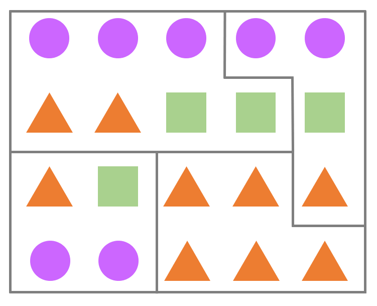
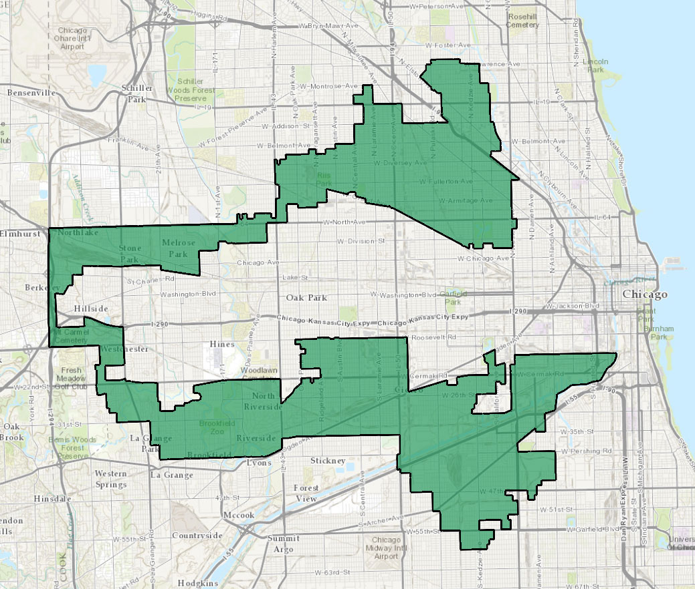

_Kirjoittaja on toisen vuoden matematiikan opiskelija ja Tyyppiarvon vieraileva kolumnisti. Petrin muihin kirjoituksiin voit tutustua hänen blogissaan_ [_Nollakohdassa_](https://www.nollakohta.fi/)_._

Mikäli ympäröivää maailmaa ja opiskelijahuone Survomon keskusteluita on uskominen, näinä aikoina järjestetään Suomessa vaalit ja pian vielä toisetkin. Kansakunnan huulilla on, _ketä_ pitäisi äänestää, mutta vähemmälle jää, _miten_ pitäisi äänestää. Vaalikoneiden suosittelualgoritmit ovat viime aikoina puhuttaneet erityisesti Helsingissä ([HS 13.3.2019](https://www.hs.fi/politiikka/art-2000006033697.html)), mutta vielä enemmän tulokseen vaikuttaa algoritmi, jolla äänet lasketaan: käytössä oleva vaalitapa.

Vaalitavan vaikutus maan poliittiseen järjestelmään on valtava, vaikkei se ainoa selittävä tekijä olekaan. Se määrää, kiroavatko kansalaiset kaksipuoluejärjestelmää vai sateenkaarihallitusta; siitä on kiinni, millaiset ovat paikallispuolueiden mahdollisuudet. Kuten kohta näemme, Suomen tapa valita eduskuntansa on kaukana täydellisestä. Mutta onko jossain muualla paremmin? Mikä oikein on paras tapa järjestää vaalit?

Vaalitapoja on vähintään yhtä monta kuin demokratioita, joten jos haluamme verrata niitä keskenään, tarvitsemme jonkinlaiset kriteerit.
Sellaisia onkin lukemattoman monta käytännöllisistä idealististen kautta kuivan teoreettisiin, mutta nämä neljä ainakin tuntuvat järkeviltä:

1. **Jos Ehdokas A saa enemmän ääniä** kuin Ehdokas B ja B tulee valituksi, niin myös A valitaan.
2. Puolueen saaman **paikkamäärän tulisi vastata sen saamaa ääniosuutta**. Tätä ominaisuutta kutsutaan suhteellisuudeksi.
3. **Äänen antamisesta täytyy olla hyötyä ehdokkaalle.** Toisin sanoen, paras tapa tukea ehdokasta ei saa olla jonkun muun äänestäminen tai kokonaan äänestämättä jättäminen.
4. Järkevään äänestämiseen tai tuloksen ymmärtämiseen **ei pidä tarvita ylempää korkeakoulututkintoa**.

Näillä varustettuna voimme tutkia muutamaa maailmalla suosittua vaalitapaa.

## Suomen malli

Aloitetaan kaikkein tutuimmasta, joka samalla on pienin muunnelmin yksi yleisimmistä maailmanlaajuisesti. Suomen eduskunta- ja eurovaaleissa käytetään suhteellista listavaalia, jossa jokaisella on yksi ääni annettavanaan oman vaalipiirinsä ehdokkaalle. Kustakin Manner-Suomen kahdestatoista vaalipiiristä valitaan 7–36 edustajaa ja Ahvenanmaalta yksi.
Nimensä tapa on saanut siitä, että se pyrkii tuottamaan ääniosuuksia vastaavia paikkamääriä myös valtakunnallisella tasolla.

Kertauksen vuoksi järjestelmä toimii näin:

- Jokainen ehdokas kuuluu jollekin ehdokaslistalle, joka vastaa esimerkiksi puoluetta tai usean puolueen vaaliliittoa.
- Ääntenlaskennassa on kaksi vaihetta. Aluksi ehdokkaat järjestetään äänten mukaan järjestykseen omien ehdokaslistojensa sisällä ja lasketaan kunkin listan äänien summa.
- Listalla eniten ääniä saanut saa kaikki listan äänet, seuraavaksi tullut puolet äänistä, sitä seuraava kolmasosan ja niin edelleen.
- Lopullinen valinta tehdään järjestämällä kaikki ehdokkaat näiden vertailulukujen mukaan.

Otetaan esimerkki kuvitteellisesta vaalipiiristä, jossa valitaan neljä edustajaa kahdeksan ehdokkaan joukosta. Ehdokkaat ovat jakautuneet kolmeen puolueeseen. Kolmiopuolue on tunnettu kärkevistä kannanotoistaan, kun taas Vmpyräliitto kiertelee ja kaartelee (kolmesataakuusikymmentä) astetta enemmän.
Viime vuosina kisaan on liittynyt vielä yhtä sivua särmikkäämpi neliöliike, joka toki on radikaalimpana ryhmittymänä vähemmän suosittu.

Vaalipäivän iltana luvut ovat seuraavat:

| Kolmiopuolue   | Ympyräliitto   | Neliöliike   |
| ---            | ---            | ---           |
| Kolmio A: 3100 | Ympyrä A: 2000 | Neliö A: 2000 |
| Kolmio B: 1000 | Ympyrä B: 1100 | Neliö B: 500  |
| Kolmio C: 900 | Ympyrä C: 900 |               |
| **Yhteensä: 5000** | **Yhteensä: 4000** | **Yhteensä: 2500** |

Äänet jaetaan ehdokkaille vertauslukuina:

1. Kolmio A saa 5000 / 1 = 5000 pistettä ja valitaan.
2. Ympyrä A saa 4000 / 1 = 4000 pistettä ja valitaan.
3. Kolmio B saa 5000 / 2 = 2500 pistettä ja valitaan.
4. Neliö A saa 2500 / 1 = 2500 pistettä ja valitaan.
5. Ympyrä B saa 4000 / 2 = 2000 pistettä.
6. Kolmio C saa 5000 / 3 = 1667 pistettä.
7. Ympyrä C saa 4000 / 3 = 1333 pistettä.
8. Neliö B saa 2500 / 2 = 1250 pistettä.

Ehdokkaiden äänimäärät eivät suoraan vastaa vertauslukuja. Ympyrä A ja Neliö A saivat saman verran ääniä, mutta ensin mainitun vertailuluku on suurempi, koska hän edustaa menestyneempää listaa. Samalla periaatteella Kolmio B tiputtaa Ympyrän B, vaikka jälkimmäinen sai enemmän henkilökohtaisia ääniä.

Hyvänä puolena, nimensä mukaisesti, suhteellinen vaalitapa pitää huolen siitä, että puolueet saavat paikkoja melko tarkasti äänimääriensä mukaisesti. Tosimaailman esimerkkinä Suomen eduskuntavaalien 2015 tulos oli tämä:

| Puolue | Ääniosuus | Paikkaosuus |
| ---    | ---       | ---         |
| Keskusta | 21,1 % | 24,5 % |
| Kokoomus | 18,2 % | 18,5 % |
| Perussuomalaiset | 17,7 % | 19,0 % |
| SDP | 16,5 % | 17,0 % |
| Vihreä liitto | 8,5 % | 7,5 % |
| Vasemmistoliitto | 7,1 % | 6,0 % |
| RKP | 4,9 % | 4,5 % |
| KD | 3,5 % | 2,5 % |
| Muut | 2,5 % | 0,5 % |

Vanha sanonta on, että maakuntien lukuisat vaalipiirit tukevat keskustaa, mutta sitä lukuunottamatta äänten ja paikkojen suhde on melkoisen tarkka. Vaalipiirien koko vaikuttaa suhteellisuuteen periaatteella isompi parempi — kaikkein reiluiten jaettu tulos saataisiin, jos koko maa olisi yksi vaalipiiri. Lisäksi on olennaista, että piirin koko vastaa sen asukaslukua, jolloin edustajien ja edustettavien suhde on koko maassa suunnilleen sama — Suomessa tämä säädetään valtioneuvoston asetuksella väestötietojen mukaan.

Suhteellisesta vaalitavasta on muutama yleinen variantti. Vertauslukujen laskemisessa voidaan käyttää erilaisia jakajia tai esimerkiksi vähennyslaskua, mikä vaikuttaa suhteellisuuteen — Suomen versio (D'Hondtin menetelmä) ei ole tässä tehokkain. Monessa maassa, esimerkiksi Ruotsissa, äänestäjä valitsee ainoastaan listan, jota äänestää, ja ehdokkaiden järjestys listalla on puolueen etukäteen päättämä. Ajatus on, että tällöin äänestäjä tietää varmasti, ketkä tulevat valituiksi hänen äänellään, mutta kääntöpuolena lista on ota tai jätä -tyyppinen.

Lisäksi joissain maissa, Ruotsi mukaan lukien, käytössä on äänikynnys, joka täytyy ylittyä valtakunnallisesti, jotta puolue voi saada paikkoja. Tämä rajaa pienimpiä puolueita pois. Suomessakin on äänikynnys, mutta se on piilevä ja riippuu kunkin vaalipiirin koosta ja ehdokasmäärästä. Keski-Suomen vaalipiirissä valituksi pääsi vertausluvulla 10 182, kun taas Helsingissä viimeisellä valitulla luku oli 13 527. Tämä johtaa siihen, että puolueet taktikoivat ehdokkaiden vaalipiirejä, kuten nytkin vaalien alla on uutisoitu ([HS 18.3.2019](https://www.hs.fi/politiikka/art-2000006039841.html)).

Suhteellisella vaalitavalla on kuitenkin kriitikkonsa. Onko oikein, että moni ehdokas häviää vähemmän ääniä saaneelle? Vuoden 2007 eduskuntavaaleissa vihreiden Tarja Cronberg sai toisiksi eniten ääniä Pohjois-Karjalan vaalipiirissä, mutta jäi tästä huolimatta eduskunnan ulkopuolelle puolueensa vaalipiirissä saaman alhaisen kokonaiskannatuksen vuoksi. Lisäksi kun vaalipiirit ovat suuria, ehdokkaat saattavat keskittyä suurempiin kaupunkeihin ja olla siksi etäisiä syrjäseutujen äänestäjille. Äänestäjä tukee ehdokasta äänestäessään koko listaa, ei ainoastaan omaa ehdokastaan. Ja onko eduskuntapuolueiden kirjo tavoiteltavaa, kun ennen vaaleja ei voi tietää, miltä hallitus lopulta näyttää ja mitkä vaalilupaukset todella otetaan työn alle?

Suomen malli pärjää kriteereissämme siis seuraavasti:

1. ❌ Vähemmän ääniä saanut ehdokas voi tulla valituksi.
2. ✅ Muunnelmasta riippumatta suhteellinen vaalitapa tuottaa ääniosuuksia melko hyvin vastaavia paikkamääriä, kunhan vaalipiirit ovat riittävän suuria.
3. ✅ Suomen mallissa ehdokas hyötyy äänen saamisesta. Hyötyä valuu myös koko listalle.
4. ✅ Äänestyskopissa riittää osata kirjoittaa suosikkinsa numero ja tulos on puoluetasolla selvä.

Melko hyvä muttei täydellinen siis. Voisiko jollain toisella tavalla korjata systeemin puutteet? Vastaus on kyllä.

## Britannian malli

Muun muassa Yhdistyneessä kuningaskunnassa ja suuressa osassa Yhdysvaltoja vaalit hoidetaan menetelmällä, jossa edustajat ovat selvemmin vastuussa koko vaalipiirilleen. Tätä systeemiä helpommaksi on vaikea pistää, ja siksi se onkin hyvin yleinen: vaalipiirissä on joukko ehdokkaita, kullakin äänestäjällä on yksi ääni ja eniten ääniä saanut voittaa. Kustakin piiristä valitaan siis tasan yksi edustaja ja piirit ovat vastaavasti alueellisesti pienempiä.

Edellinen esimerkki voitaisiin sovittaa tähän malliin jakamalla vaalipiiri neljään pienempään alueeseen, jossa kullakin puolueella on yksi ehdokas.  
Kannatusluvut saattaisivat olla jossakin pikkupiirissä vaikka seuraavat:  

| Ehdokas | Ääniosuus |
| --- | --- |
| Kolmio A | 45 % |
| Ympyrä A | 35 % |
| Neliö A  | 20 % |

Koska kolmiopuolueen ehdokkaalla on suurin ääniosuus, vaikkei ehdoton enemmistö olekaan, hänet valitaan, ei sen kummempaa. Tämä prosessi toistetaan jokaisessa vaalipiirissä.

Huono puoli on se, että prosessi toistuu vähän liiankin tarkasti. Jos kolmiot ovat joka piirissä _hitusenkin_ suositumpia kuin ympyrät ja neliöt, niin joka piiri saa edustajansa kolmiopuolueesta. 45 prosentin kannatuksella saakin sata prosenttia paikoista! Tämä ei ole mikään teoreettinen murhe, kuten Yhdistyneen kuningaskunnan vuoden 2017 vaalien tulos osoittaa:

| Puolue | Ääniosuus | Paikkaosuus |
| ---    | ---       | ---         |
| Konservatiivit | 42,34 % | 48,8 % |
| Työväenpuolue | 39,99 % | 40,3 % |
| Liberaalidemokraatit | 7,37 % | 1,8 % |
| Skotlannin kansanpuolue | 3,04 % | 5,4 % |
| Itsenäisyyspuolue (UKIP) | 1,84 % | 0,0 % |
| Vihreät | 1,63 % | 0,2 % |
| Demokraattinen unionistipuolue | 0,91 % | 1,5 % |
| _Muut_ | 2,88 % | 2,0 % |

Useimmissa vaalipiireissä kisa käydään konservatiivien ja työväenpuolueen välillä. Näissä piireissä liberaalidemokraatit eivät ole kärjessä, joten heille annettu ääni menee hukkaan. Pieni puolue tarvitsee vahvan ehdokkaan voittaakseen piirinsä. Siksi alueellisuudesta on hyötyä: Pohjois-Irlannin demokraattinen unionistipuolue DUP voittaa omissa vaalipiireissään, kun taas koko maassa toimivan UKIPin kannatus on yksittäisissä piireissä niin ohut, ettei paikkoja heru, vaikka kokonaisprosentti on kaksinkertainen.

Tämä systeemi pakottaa siis äänestäjän taktikoimaan. Jos itselle mieluisa ehdokas ei ole kärkikahinoissa, häntä on täysin turha äänestää. Kuka siis olisi pienin paha varteenotettavista ehdokkaista? Ja entäs jos kannatus jakautuukin tasan kolmioiden, neliöiden ja ympyröiden kesken? Ellei kulmikas enemmistö liittoudu, vaalipiiri menee ympyröille.

Ehkä tunnetuin esimerkki tästä on Yhdysvaltojen presidentinvaaleista vuodelta 2000. Kisa republikaani **George W. Bushin** ja demokraatti **Al Goren** välillä jäi Floridan valitsijamiesten varaan — koko osavaltiossa heidän äänieronsa oli vain satoja ääniä. Pitkällisen uudelleenlaskennan jälkeen Bush julistettiin voittajaksi, mutta siitä jossittelu vasta alkoi: oliko vihreiden **Ralph Nader** kerännyt liberaalien ääniä, jotka muuten olisivat tehneet keskustaliberaalista Goresta presidentin? Sitä voi miettiä, kuten sitäkin, että vuonna 2016 voittanut **Donald Trump** sai lähes kolme miljoonaa ääntä vähemmän kuin **Hillary Clinton**.

Sen lisäksi, että häviävän ehdokkaan saamat äänet menevät hukkaan, niin käy myös voittajille. Kun ehdokas on saanut äänienemmistön, lopuilla äänillä ei ole enää mitään merkitystä. Tästä taas seuraa, että vaalipiirien suunnittelulla on merkitystä. Jatketaan esimerkkiämme ja piirretään kolmen puolueen kannatus neljän vaalipiirin kartalle:

Ympyräliitolla on kaikissa paitsi yhdessä piirissä täpärä enemmistö, joten se voittaa kolme piiriä neljästä. Viimeinen piiri on suunniteltu keräämään kolmiopuolueen ääniä pois muista piireistä, joissa ne olisivat ratkaisevia. Sopivalla piirien piirtämisellä, mikä tunnetaan myös nimellä _gerrymandering_, toiseksi isoin puolue saakin siis suurimman osan paikoista.  

Mikäli vaalipiirien määrääminen on alueellisesti hallitsevan puolueen oikeus, kuten Yhdysvalloissa on, niin rajalinjat alkavatkin kenties noudattaa enemmän etnisiä kuin maantieteellisiä eroja. Vai mitä sanot tästä vaalipiiristä Chicagon seudulla, joka _sattuu_ olemaan latinoenemmistöinen ja siksi vahvasti demokraatteihin kallellaan?

  
_Kuva: [Wikimedia Commons](https://en.wikipedia.org/wiki/File:Illinois_US_Congressional_District_4_(since_2013).tif), public domain, rajattu._

Enemmistö saattaa siis hävitä tässä vaalitavassa. Se ehdokas voittaa, joka saa eniten ääniä: kymmenen ehdokkaan joukossa riittää siis teoriassa hitusen yli 10 prosentin ääniosuus. Yhden ehdokkaan toisistaan riippumattomat vaalipiirit taas johtavat siihen, että lopputulos ei vastaa valtakunnallista kannatusta. (Useamman ehdokkaan valitseminen kustakin piiristä ei ole yleistä, sillä se ei auta kovin paljoa.)

Tämä vaalitapa suosii kaksipuoluejärjestelmiä, missä on hyväkin puolensa. Voittava puolue pystyy muodostamaan enemmistöhallituksen omin avuin eikä voi venkoilla vaalilupauksistaan. (Tosin tätä kirjoitettaessa UK:ssa tilanne on hieman monimutkaisempi…)  
Kriteeriemme valossa tulos on tämä:

1. ✅ Piirin sisällä valituksi tulee aina eniten ääniä saanut ehdokas.
2. ❌ Ääniosuudet ja paikkamäärät eivät välttämättä vastaa toisiaan alkuunkaan.
3. ⚠ Ehdokkaan äänestäminen on paras tapa tukea tätä, mutta monessa tapauksessa siitä ei ole mitään hyötyä.
4. ✅ Äänestyskopissa tarvitsee vain ruksata oma suosikkinsa… niiden muutaman joukosta, joita kannattaa äänestää. Voittajasta ei ole mitään epäselvyyttä.

Tämä malli siis korjaa suhteellisen vaalitavan vajeet, mutta valitettavasti samalla kadottaa sen hyvät puolet. Löytyisikö kanaalin toiselta puolelta parempi ratkaisu?

## Ranskan malli

Muun muassa Ranskassa käytössä oleva malli pyrkii korjaamaan sen ongelman, että voittavalla ehdokkaalla ei välttämättä ole ehdotonta enemmistöä tukenaan. Saatat tuntea järjestelmän jo entuudestaan, koska sitä käytetään myös Suomen presidentinvaaleissa.

Perusrakenne on sama kuin Britannian mallissa: kustakin vaalipiiristä valitaan yksi ehdokas. Mikäli yksikään ehdokas ei saa yli 50 prosenttia äänistä, järjestetään toinen kierros. Presidentinvaaleissa toiselle kierrokselle jatkaa kaksi menestyneintä, Ranskan parlamenttivaaleissa jokainen 12,5 % äänikynnyksen ylittänyt. Toisella kierroksella eniten ääniä saanut — joka kahden ehdokkaan tapauksessa saa varmasti ehdottoman enemmistön — voittaa.

Edellisessä esimerkissämme luvut olivat seuraavat:

| Ehdokas | Ääniosuus |
| --- | --- |
| Kolmio A | 45 % |
| Ympyrä A | 35 % |
| Neliö A  | 20 % |

  

Jos noudatetaan presidentinvaalien sääntöä, toiselle kierrokselle pääsevät kolmio ja ympyrä. Nyt neliöliikettä äänestäneillä (ja toki muillakin) on mahdollisuus valita parempi näistä: lopullinen tulos riippuu siitä, kummalle he kallistuvat antamaan äänensä. Ensimmäisellä kierroksella voi siis äänestää mitä tahansa puoluetta ilman pelkoa äänensä menemisestä hukkaan.

Todellinen esimerkki saadaan Ranskan vuoden 2017 parlamenttivaaleista. Ensimmäisellä kierroksella vain neljästä vaalipiiristä pääsi läpi enemmisön saanut ehdokas: loput 573 jäivät toisen kierroksen varaan.  
Kuudentoista puolueen joukossa toisella kierroksella nähtiin muun muassa seuraavia tuloksia:

| Puolue | Ääniosuus | Paikkaosuus |
| ---    | ---       | ---         |
| La République en Marche | 43,06 % | 53,4 % |
| Les Républicains | 22,23 % | 19,5 % |
| Front National | 8,75 % | 1,4 % |
| Mouvement Démocrate | 6,06 % | 7,3 % |

Kuten taulukosta näkyy, tämä menetelmä ei korjaa Britannian mallin pahinta puutetta: pienet vaalipiirit ovat edelleen toisistaan riippumattomia eikä suhteellisuus siis toteudu. Järjestelmä tukee erityisesti keskustapuolueita, sillä marginaalisemmilla liikkeillä on vaikeampaa päästä äänikynnyksen yli.

Lisäksi kaksi samankaltaista ehdokasta voivat tuhota toistensa mahdollisuudet kuten Briteissäkin — tai kumpikin päätyä toiselle kierrokselle, jolloin kokonaan eri mieltä olevilla ei ole pahemmin syytä äänestää. Ranskan presidentinvaaleissa 1995 oli lähellä, että kaksi keskustaoikeistolaista päätyisi toiselle kierrokselle, jolloin vasemmiston kannattajat olisivat luultavasti jääneet kotiin.

On tärkeää huomata, että vaikka jälkimmäinen ongelma onkin mahdollinen, suhteellisuuden puute ei vaikuta Suomen presidentinvaaleihin, koska vaalipiirejä ja vapaita paikkoja on tasan yksi.
Tässä kuitenkin puhutaan parlamenttivaaleista, ja niiden osalta tulos on:

1. ✅ Kussakin piirissä valitaan aina eniten ääniä saanut ehdokas.
2. ❌ Järjestelmä ei ole suhteellinen.
3. ✅ Ääni ei mene yhtä pahasti hukkaan ensimmäisellä kierroksella, joskaan toiselle kierrokselle ei välttämättä päädy mieluista ehdokasta.
4. ⚠ Äänestäminen itsessään on yksinkertaista, mutta se pitää tehdä kahdesti. Voittaja on selvä.

Ihan hyvä mutta silti puutteellinen korjausyritys siis. Paljoa ei voitu odottaakaan, sillä kahden puolueen erikoistapauksessa tämä ei eroa mitenkään Britannian mallista. Voisiko rajumpi korjausliike, tällä kertaa Lontoosta luoteeseen, parantaa tilannetta enemmän?

## Irlannin malli

Irlannissa, Australiassa ja muun muassa joissakin Yhdysvaltojen kaupungeissa käytetään siirtoäänimallia, jossa äänestäjä pistää ehdokkaat paremmuusjärjestykseen. Mikäli ehdokas ei tule valituksi, hänen äänensä siirretään seuraavaksi parhaille. Samoin valittujen ehdokkaiden "ylimääräiset" äänet jaetaan eteenpäin. Kun joka piiristä valitaan useampi edustaja, kuten vaikka Irlannissa, suhteellisuus on mahdollista saavuttaa.

Ääntenlasku on hieman mutkikkaampaa, joten otetaan yksinkertaistettu esimerkki. Valitaan kaksi ehdokasta neljän joukosta, kun erilaiset äänestysliput ovat jakautuneet seuraavasti. Äänestäjä voi äänestää niin montaa ehdokasta kuin haluaa, kuten lipukkeista näkyy.

| Ääniä | 1. sija | 2. sija | 3. sija | 4. sija |
| ----- | --- | --- | --- | --- |
| 1800 ääntä | Kolmio A | Kolmio B | Neliö A | Ympyrä A |
| 1250 ääntä | Ympyrä A | | | |
| 900 ääntä | Kolmio B | Kolmio A | Neliö A | |
| 800 ääntä | Kolmio B | Ympyrä A | | |
| 625 ääntä | Ympyrä A | Kolmio A | Kolmio B | |
| 625 ääntä | Ympyrä A | Kolmio B | Kolmio A | |
| 600 ääntä | Neliö A | Kolmio B | | |
| 350 ääntä | Neliö A | Kolmio A | | |
| 50 ääntä | Neliö A | Ympyrä A | Kolmio A | |
| 50 ääntä | Neliö A | | | |
| 50 ääntä | Kolmio A | | | |

Ihan ensiksi määritetään, kuinka monta ääntä tarvitaan valituksi tulemiseen. Tämä luku saadaan jakamalla annettujen äänten määrä paikkojen määrä plus yhdellä sekä lisäämällä osamäärään yksi. Tässä tapauksessa luku on 7100/3 + 1 = 2368.

Ensimmäisellä laskentakierroksella lasketaan ykkösäänet:

- Ympyrä A: 1250 + 625 + 625 = 2500,
- Kolmio A: 1800 + 50 = 1850,
- Kolmio B: 900 + 800 = 1700,
- Neliö A: 600 + 400 + 50 = 1050.

Ympyrä A ylittää valintarajan 132 äänellä. Hänen äänistään joka neljännessä Kolmio A on toinen vaihtoehto ja joka neljännessä Kolmio B.
Siispä Kolmiot A ja B saavat kumpikin neljäsosan ylimääräisistä äänistä.
Lopuissa ei ole toista vaihtoehtoa, joten ne poistetaan laskennasta.
Tilanne on siis seuraava:

- Ympyrä A: 2500 - 132 = 2368 (valittu),
- Kolmio A: 1850 + 33 = 1883,
- Kolmio B: 1700 + 33 = 1733,
- Neliö A: 1050.

Nyt kenenkään äänet eivät ylitä rajaa, joten kaikkein vähiten ääniä saanut, Neliö A, tiputetaan kisasta. 600 häntä äänestänyttä piti Kolmiota B toiseksi parhaana, joten hän saa 600 lisä-ääntä. Kolmio A puolestaan saa 400 ylimääräistä ääntä — 350 toiseksi parhaana ja loput 50 kolmantena vaihtoehtona, sillä Ympyrä A on jo valittu. Jälleen 50 ääntä poistetaan laskennasta, sillä niissä ei ole seuraavaa ehdokasta. Selvästikin useimmat Neliön A kannattajat tiesivät, että heidän suosikkinsa luultavasti tippuu kisasta, joten oli strategisesti fiksua valita useampi ehdokas.
Lisä-äänien jälkeen laskenta näyttää tältä:

- Ympyrä A: 2368 (valittu),
- Kolmio B: 1733 + 600 = 2333,
- Kolmio A: 1883 + 400 = 2283.

Edelleenkään kukaan ei ylitä kynnystä, joten nyt puolestaan Kolmio A tiputetaan vähiten ääniä saaneena. Hänen pinossaan on seuraavasti ääniä:

- 1800 ääntä järjestyksessä Kolmio A > Kolmio B > Neliö A > Ympyrä A,
- 350 ääntä järjestyksessä Neliö A > Kolmio A,
- 50 ääntä järjestyksessä Neliö A > Ympyrä A > Kolmio A,
- 50 ääntä, joissa ainoana valintana Kolmio A,
- 33 ääntä järjestyksessä Ympyrä A > Kolmio A > Kolmio B.

Pinossa on 450 ääntä, joissa ei enää ole seuraavaa ehdokasta. Ne poistetaan laskennasta. Lopuissa 1833 lipukkeessa Kolmio B on seuraavaksi paras, joten lopullinen tulos on

- Kolmio B: 2333 + 1833 = 4166 (valittu),
- Ympyrä A: 2368 (valittu).

Vaikka Kolmio A saikin enemmän ykkösääniä kuin Kolmio B, jälkimmäinen voitti parempana kompromissiehdokkaana muita äänestäneille. Häviävän ehdokkaan äänestämisestä ei ollut haittaa, koska ääni jatkoi elämäänsä seuraavaksi parhaan tukena. Samoin voittajien ylimääräiset äänet valuivat muiden tueksi.

Vähän vaikeampaa on todistaa, että tämä vaalitapa on melko suhteellinen: "ääniosuus" ei sellaisenaan tarkoita mitään, koska sama ääni voidaan laskea monelle ehdokkaalle eri vaiheissa laskentaa. Käytännössä tapaa pidetään suhteellisena, jopa Irlannissa, jossa joka piiristä valitaan vain 3–5 edustajaa. Irlannissa on haettu tasapainoa, jossa piirit ovat riittävän pieniä, jotta edustajat ovat lähellä valitsijoitaan, mutta eivät niin pieniä, että suhteellisuus katoaisi kokonaan.

Voisiko tässä olla täydellinen tapa järjestää vaalit?

Ei liene vaikeaa arvata, että ei ole. Kuten helppokin esimerkki osoitti, tämä systeemi on hirvittävän monimutkainen. Ääntenlaskuun vierähtää tolkuttomasti aikaa, koska laskennassa on monen monta kierrosta.
Ongelmaksi tulee myös valittujen ehdokkaiden ylimääräisten äänten jakaminen: millä menetelmällä lipukkeet jaetaan muille? Vaihtoehtoja on käytännössä kaksi: joko tehdä laskenta kokonaan tietokoneella tai poimia lipukkeita satunnaisotannalla. Jälkimmäisessä tapauksessa vaalitulos riippuu siis osin arpaonnesta.

Tietyissä Australian vaaleissa on vielä sekin kummallisuus, että äänestäjän täytyy laittaa _jokainen ehdokas_ järjestykseen. Tämä aiheuttaa tietynasteista epämukavuutta, kun ehdokkaita on toistakymmentä kappaletta. Helpottavana tekijänä äänestäjällä on myöskin mahdollisuus ruksata jonkin puolueen ennakkoon luoma järjestys. Sekään tosin ei pelasta kaikelta: vuoden 1999 Uuden Etelä-Walesin osavaltiovaalissa Australiassa 80 puoluetta asetti 264 ehdokasta, mikä aiheutti jonkinasteisen käytännön ongelman pelkästään äänestyslipukkeen koossa…

Vielä yksi ongelma liittyy siihen, että äänen antaminen saattaa olla haitaksi ehdokkaalle. Syy on siinä, että äänet vaikuttavat siihen, missä järjestyksessä ehdokkaita pudotetaan. Koska pudonneen ehdokkaan äänet siirtyvät eteenpäin, se vaikuttaa edelleen siihen, kuka pudotetaan seuraavaksi. Hyvin yksinkertaisena esimerkkinä voisi käydä näin:

- Muutama äänestäjä asettaa ehdokkaat järjestykseen Neliö > Kolmio > Ympyrä,
- Ympyrä putoaa ja häntä äänestäneiden äänet siirtyvät Kolmiolle,
- Kolmio ylittää valintakynnyksen ja voittaa,

kun taas rinnakkaisuniversumissa

- Muutama äänestäjä asettaa ehdokkaat järjestykseen Ympyrä > Neliö > Kolmio,
- Ympyrällä on hieman enemmän ykkösääniä kuin Kolmiolla, joten Kolmio putoaa ja hänen äänensä siirtyvät Neliölle,
- Neliö ylittää valintakynnyksen ja voittaa.

Tässä siis paras tapa tukea Neliötä oli äänestää poliittisesti vastakkaista ehdokasta! Vaikka todellisissa vaaleissa tällainen tilanne olisikin epätodennäköinen, sen mahdollisuus on huolestuttava merkki systeemin epävakaudesta.

Näistä sekä historiallisista syistä tätä mallia ei juuri käytetä maailmalla, ja usein sen käyttäjät ovat pieniä alueita. Ei siis ole mitään käytännön taetta, että se toimisi useamman kymmenen miljoonan asukkaan valtiossa. Kuten huomasimme, myöskään teoreettinen analyysi ei ole niin yksinkertaista, kun äänet risteilevät ehdokkaiden välillä. Meidän kriteerimme ovat kuitenkin selvillä:

1. ⚠ Ykkösäänillä mitaten valinnat eivät tapahdu paremmuusjärjestyksessä. Toisaalta siirtoäänet eivät ole suoraan vertailukelpoisia muiden järjestelmien kanssa.
2. ✅ Järjestelmä on suhteellinen, kunhan vaalipiirit ovat tarpeeksi suuria.
3. ⚠ Teoriassa on mahdollista, että äänestä on haittaa ehdokkaalle. Tämä on kuitenkin epätodennäköistä. Järjestelmä estää äänen menemisen hukkaan.
4. ❌ Tuloksen laskenta on hidasta ja epäintuitiivista.

Täydellisestä jäätiin siis kauaksi tälläkin kertaa, vaikka alkuun idea vaikuttikin hyvältä.

## Mitä tästä opimme?

Syy toistuviin epäonnistumisiin on se, että täydellistä vaalitapaa ei ole olemassa. Tämä johtuu siitä, että kriteerit ovat keskenään ristiriitaisia: kaikkia neljää ei voi toteuttaa yhtä aikaa. Edes sellainen käsite kuin enemmistö ei toimi. Kuvitellaan, että kansa vastaisi kysymyspatteristoon yliopistopolitiikasta seuraavasti:

- 1/3 mielestä miltään tiedekunnalta ei saa leikata.
- 1/3 mielestä vain luonnontieteilijöiltä pitää leikata.
- 1/3 mielestä vain muilta kuin luonnontieteilijöiltä pitää leikata.

Nyt kaksi kolmesta on sitä mieltä, että jostain täytyy kiristää rahahanoja.
Kaksi kolmesta on myös sitä mieltä, että luonnontieteilijöiltä ei saa ottaa pois. Kaiken lisäksi enemmistö on myös sitä mieltä, että rahaa ei saa vähentää muilta. Leikata siis pitää muttei keneltäkään!

Matemaattisesta näkökulmasta päätöksiä ei siis voi tehdä oikein. Vaalitavan valinnassa on pakko arvottaa myös yhteiskunnallisia tavoitteita ja tehdä kompromisseja — ja sen tehtyään sulkea korvansa teoreetikoilta, jotka luettelevat valitun systeemin virheitä.

Yhdessä maassa toimiva järjestelmä ei välttämättä toimi toisessa eivätkä siksi tämänkään tekstin esimerkit eivät ole täysin vertailukelpoisia.
Esimerkiksi Britannian ja Ranskan mallit ovat hyvin samankaltaiset, mutta puoluekentät täysin erilaiset. Lisäksi nykyään monessa maassa käytetään hybridijärjestelmiä, jotka yhdistävät kaksi erilaista järjestelmää yksiin vaaleihin: vaikkapa Saksassa osa ehdokkaista valitaan brittimallilla ja loput Ruotsin tapaan suhteellisella listavaalilla.

Äänioikeutetun kansalaisen tehtäväksi jää selvittää, miten parhaiten voi vaikuttaa. Suomeen valitussa mallissa yksi piirre on selvä: joka äänellä on merkitystä. Tee siis tilastotieteilijä onnelliseksi ja ole yksi datapiste tulosillassa!

_Viitteitä:_

- Farrell, David M.: _Electoral Systems: A Comparative Introduction_ (Palgrave 2001)
- [Oikeusministeriön Vaalit.fi](https://vaalit.fi/etusivu)
- [Irlannin vaalitapa](https://www.housing.gov.ie/sites/default/files/migrated-files/en/Publications/LocalGovernment/Voting/how_the_dail_is_elected_-_2016_english_-_final.pdf)
