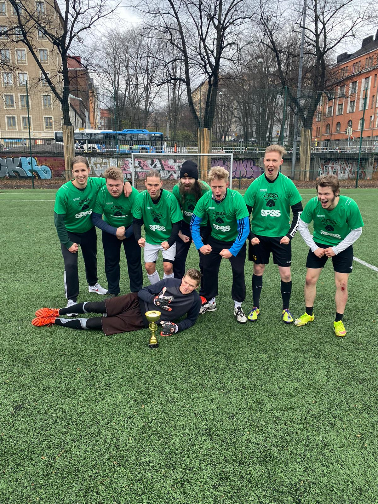

Muutama vuosi sitten aktiivitoimintansa lopettanut Moodin Palloseura MoPSi teki marraskuun alussa kunniakkaan paluun pallokentille ja lähti mukaan kilvoittelemaan Valtsikan jalkapalloherruudesta Haapaniemen sateiselle kentälle. Joukkueen rungon muodostivat naftaliinista kaivetut MoPSi-legendat Risko Rikkinen, Patrik Lauha, Santeri Mikkonen, Aleksi Laiho ja Leo Nikkanen. Viisikkoa täydensivät tuoreemmat MoPSi-kasvot matemaattisten tieteiden kandiohjelmalaiset, Alex Lähdekorpi, Vikke Kilponen sekä maalivahti Veikko Laatikainen.

Joukkueen menestyshaaveet ennen pelejä olivat maltilliset ja joukkueen kapteeni Risko Rikkinen totesikin etukäteen päätavoitteeksi "Kunhan ei ketään pahasti sattuisi, vaikka toki jatkoonpääsyynkin on olemassa nollaa suurempi todennäköisyys". Ennakkoluuloton koiralauma lähti turnaukseen kuitenkin pää pystyssä ja nappasi avauslohkon kolmesta pelistään kaksi voittoa ja yhden rankkaritappion. Etenkään Kilposta ja Lähdekorpea eivät MoPSin karvaan menneisyyden jalkapallotraumat painaneet vaan miehet esittivät pirteää hyökkäyspelaamista vastaten joukkueen kaikista alkulohko-osumista.

Ennen jatkopelejä vihreäpaidat kokivat kovan kolauksen joukkueen maalivahdin ilmoittaessa, että hän lähtee nyt risteilemään KJYRille. Hyväntahdon eleenä Laatikainen jätti kuitenkin maalivahdinhanskansa joukkueen käyttöön, jotta joukkueella olisi edes teoreettinen todennäköisyys löytää veräjänvartija jatkopeleihin. Hätä ei ollutkaan tämän näköinen, vaan koiralauma rekrytoi maalilleen ex-huippulupauksen ja MoPSia moneen kertaan aiemminkin vahvistaneen Markus Lauhan. Maalivahtitilanteen selvittyä joukkue vetäytyi hyvillä mielin lounaalle Hakaniemen Fafasiin pohtimaan strategisia kuvioita pudotuspelejä varten.

Pitaleipäpohjainen hiilihydraattitankkaus onnistui erinomaisesti ja vatsat täynnä peleille palannut turnauksen musta hevonen oli pudotuspeleissä täyttä rautaa. Yhteiskuntahistorian opiskelijoiden organisaatio Real Torspo sai kokea moodilaisten mahdin, kun MoPSi jyräsi puolivälierässä Ö.L. Torspon lukemin 6-0 ja välierissä Torspo Nationin 5-0. Voittojen takuumiehenä hääri molemmissa otteluissa hattutempun iskenyt Alex Lähdekorpi, jonka hurjat kudit painuivat maaliin joka puolelta kenttää.

Turnaus huipentui unelmafinaaliin, kun MoPSia vastaan asettui turnauksessa tappioton, rakas vihollinen KTTO. Taitavalla ja leveällä kokoonpanolla operoineet taloustieteilijät siirtyivät ansaitusti 1-0-johtoon, mutta urhea koiralauma ei takaiskusta hätkähtänyt, vaan jatkoi sinnikkäästi taistelua ylivoimaista vastustajaansa vastaan. Pelin puolivälin tienoilla Vikke Kilponen levitti balsamia tilastotieteilijöiden haavoihin tasoittamalla sensaatiomaisesti ottelun nopeasta vastahyökkäyksestä. KTTO protestoi maalia edeltänyttä tilannetta ankarasti, mutta puolueettomien silminnäkijöiden mukaan pallo osui lähes varmasti, eli todennäköisyydellä 1, Patrik Lauhaa johonkin muuhun ruumiinosaan kuin käteen. Lisää herkkua yleisön mopsinpenikoille oli luvassa hetken kuluttua Alex Lähdekorven ladattua omalta alueelta lähetetyn toiveikkaan pitkän avauksen hurjalla kääntölaukauksella maaliin. Tappiolle ajautunut KTTO jahtasi tasoitusosumaa hurjalla intensiteetillä, mutta MoPSin uhrautuva puolustus ja turnauksessa ainoastaan yhden maalin päästänyt maalivahti eivät olleet yllätettävissä. Kirsikkana kakun päälle läpiajoon vapautettu Lähdekorpi kaadettiin vielä rangaistuslaukauksen arvoisesti ja mies viimeisteli varmasti MoPSille pelitapahtumiin nähden vähemmän ansaitun, mutta sitäkin maukkaamman 3-1-voiton.

Mestarit: Aleksi Laiho (vas.), Santeri Mikkonen, Alex Lähdekorpi, Risko Rikkinen, Patrik Lauha, Leo Nikkanen, Vikke Kilponen ja Markus Lauha (alh.)
